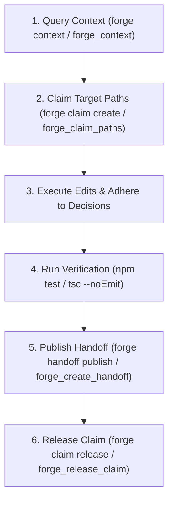

# Universal Forge Collaboration Skill

Forge is a local-first collaboration layer that enables humans and AI coding agents to work concurrently on the same codebase using Conflict-Free Replicated Data Types (CRDTs).

This skill guides AI agents and CLI tools on how to collaborate safely, avoid collision, adhere to shared team decisions, and produce verified checkpoints.

---

## 🎯 Core Agent Playbook

Whenever you are working in a repository with an active Forge session:



---

## 🛠️ Step-by-Step Instructions for Agents

### Step 1: Query Active Collaboration Context
Before modifying code, check what teammates and other agents are doing and what architectural constraints exist.

**CLI:**
```bash
forge context [paths...] --max-tokens 1500
```
**MCP Tool:** `forge_context({ paths: ["src/..."], maxTokens: 1500 })`

---

### Step 2: Claim Your Target Paths
Signal intent to prevent other agents or humans from colliding with your changes. Soft claims automatically decay via TTL (default 15 mins).

**CLI:**
```bash
forge claim create "src/auth/*" --reason "Refactoring token verification" --ttl 900
```
**MCP Tool:** `forge_claim_paths({ paths: ["src/auth/*"], ttlSeconds: 900 })`

---

### Step 3: Record Shared Decisions (When Making Architectural Choices)
Whenever you introduce a pattern, dependency, or schema choice that affects the rest of the codebase, publish a decision so other agents follow it.

**CLI:**
```bash
forge decision publish "Use jose library for JWT verification" --paths "src/auth/*" --rationale "Zero native dependencies and edge-runtime compatible"
```
**MCP Tool:** `forge_record_decision({ statement: "Use jose library for JWT verification", affectedPaths: ["src/auth/*"], rationale: "..." })`

---

### Step 4: Verify and Publish a Handoff Record
When you finish a task, verify the build/tests and publish a structured handoff record.

**CLI:**
```bash
forge handoff publish -m "Implemented token verification" --verify "npm test" -c src/auth/jwt.ts
```
**MCP Tool:** `forge_create_handoff({ summary: "Implemented token verification", changedPaths: ["src/auth/jwt.ts"], verification: [{ command: "npm test", outcome: "passed" }] })`

---

### Step 5: Release Your Path Claim
Once your handoff is published, release your claim so teammates know the path is free.

**CLI:**
```bash
forge claim release <claimId>
```
**MCP Tool:** `forge_release_claim({ claimId: "clm_..." })`
