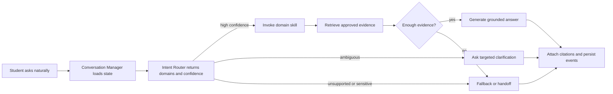

# CampusOne — Project Overview

**Tagline:** Ask once. Get routed right. Get it resolved.  
**Brand Identity & Logo:** The official visual identity is the minimal monochrome archway monogram, located at `assets/branding/logo.png` (white mark for dark mode) and `assets/branding/logo-dark.png` (dark mark for light mode). It combines a classical campus architectural archway with an integrated numeral "1", representing the single front door, with full background transparency.

**Status:** implementation-ready hackathon specification

**Audience:** product owners, coding agents, backend/frontend engineers, evaluators, and demo operators

**Canonical decisions:** see [17 Engineering Decisions](17_Engineering_Decisions.md). When another document disagrees with this overview, the Engineering Bible and the decision record win.

## 1. Product summary

CampusOne is a single conversational front door for university support. A student asks naturally in one chat; CampusOne detects one or more intents, chooses a registered domain skill, retrieves university-approved evidence, and returns a concise answer with citations. It asks a targeted clarification question when routing confidence is insufficient, and it creates a contextual handoff instead of guessing when the request is unsupported, sensitive, or unresolved.

The product is an orchestration layer, not a generic chatbot and not five separate bots placed behind tabs. The frontend presents one assistant. The backend owns routing, evidence boundaries, skill invocation, state, handoff, and measurement.

## 2. Problem and users

### Problem

The university has specialist support areas—IT, Finance, Facilities, Academics, and Administration—but students do not know which office or assistant owns a question. Existing entry points cause misrouting, repeated explanations, and answers that are difficult to verify. A successful system must make the organisation invisible while preserving organisational ownership internally.

### Primary user

An authenticated student who wants an answer or a clear next action without knowing the responsible department.

### Secondary users

- **Support agent:** receives escalated conversations with context, suggested department, and reason.
- **Knowledge administrator:** uploads, versions, publishes, and retires approved source documents.
- **Analyst/evaluator:** inspects routing, grounding, resolution, and test-run metrics.
- **Platform administrator:** manages domains, configuration, access, and audit records.

## 3. Vision and principles

1. **One front door:** users do not select a department before asking.
2. **Evidence before prose:** university-specific facts require retrieved evidence.
3. **Confidence is a product behavior:** uncertainty produces clarification or handoff, not a confident guess.
4. **Skills are replaceable:** every domain implements the same interface and can be registered without frontend changes.
5. **Conversation is stateful:** topic changes and multiple intents are first-class.
6. **Every outcome is measurable:** routing and resolution decisions emit auditable events.
7. **Prototype scope stays honest:** one deployable backend, one web app, five domains, and a deterministic evaluation harness are preferred over premature microservices.

## 4. Goals

### MVP goals

- Route clear single-intent requests to IT, Finance, Facilities, Academics, or Administration.
- Return grounded answers with visible source citations.
- Detect and handle multi-intent messages.
- Detect topic switches in an existing conversation.
- Ask clarification in the ambiguous confidence band.
- Refuse to invent answers when retrieval has no adequate evidence.
- Create a human handoff containing conversation context and reason.
- Persist conversation, routing, retrieval, citation, feedback, handoff, and resolution records.
- Provide an admin analytics view with the required routing and resolution metrics.
- Ship a deterministic JSONL evaluation dataset and CLI harness.
- Deploy locally with Docker Compose and in a common cloud setup.

### Success criteria for the hackathon

The demo can complete the scripted flow in [15 Demo Runbook](15_Demo_Runbook.md), and the evaluator can inspect:

- the selected domain and confidence behavior,
- evidence citations in the answer,
- a clarification instead of a guess,
- a safe no-answer/handoff,
- a topic switch and a multi-domain response,
- dashboard metrics and at least one routing error.

Recommended initial quality gates, to be validated against the seeded dataset rather than treated as guarantees:

| Metric | MVP target |
|---|---:|
| Macro routing accuracy on clear cases | >= 0.85 |
| Macro routing F1 | >= 0.80 |
| Source coverage on factual answers | >= 0.95 |
| No-evidence hallucination rate | 0% on safety test set |
| Citation precision | >= 0.95 |
| End-to-end resolution on answerable cases | >= 0.75 |
| Clarification rate on deliberately ambiguous cases | >= 0.70 |

## 5. Non-goals

- Replacing university ERP, payment gateway, identity provider, ticketing, or facilities-management systems.
- Performing payments, changing grades, changing identity data, or granting access in the MVP.
- Building a general web-search assistant.
- Training a custom foundation model.
- Exposing hidden chain-of-thought or internal model reasoning.
- Supporting every university policy on day one.
- Running each domain as a separate deployable microservice.

## 6. Product boundaries

The assistant may explain an approved process and provide a supported next action. It must not claim that an external transaction succeeded unless a trusted university system integration confirms it. For prototype flows, payment status, account state, and user records are illustrative knowledge-base content or mock integration responses and must be labelled accordingly.

The supported domain keys are stable API identifiers:

| Key | Display name | Ownership examples |
|---|---|---|
| `it` | IT | password, Wi-Fi, portal login, university email |
| `finance` | Finance | fees, payment status, refunds |
| `facilities` | Facilities | maintenance, electricity, air conditioning |
| `academics` | Academics | attendance, exams, course registration |
| `administration` | Administration | bonafide certificate, official documents, student data |

## 7. High-level user journey

## 8. MVP versus later

| Capability | MVP | Later |
|---|---|---|
| Mock student login | Yes | University SSO/OIDC |
| Five domain skills | Yes | Pluggable campus-wide registry |
| PostgreSQL + pgvector | Yes | Dedicated vector service if scale requires |
| Non-streaming chat response | Yes | SSE token streaming |
| Manual knowledge publishing | Yes | Scheduled connectors and approval workflow |
| Contextual handoff record | Yes | Ticket-system integration |
| Rules + embeddings + structured LLM router | Yes | Calibrated learned classifier |
| Basic admin dashboard | Yes | Role-specific operational console |
| English only | Yes | Multilingual routing and answer generation |

## 9. Definition of success

CampusOne is successful when an evaluator can ask a question without knowing its department, receive a supported and cited response or a useful next action, observe a safe clarification when uncertainty is high, and verify the system's decision and resolution outcome in analytics. The architecture is successful when a sixth domain can be added by implementing the skill contract, adding its configuration and knowledge sources, and adding tests—without changing the chat UI or router control flow.

