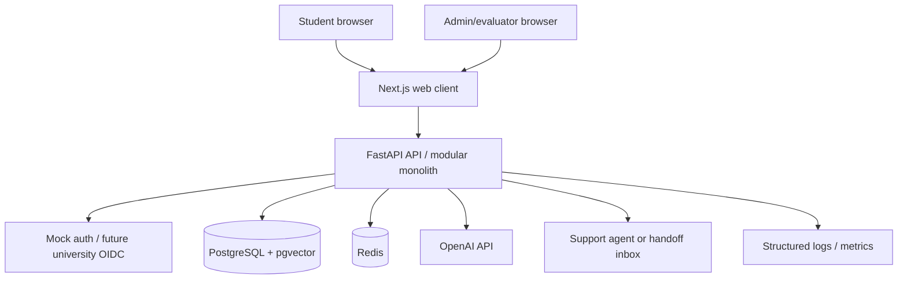
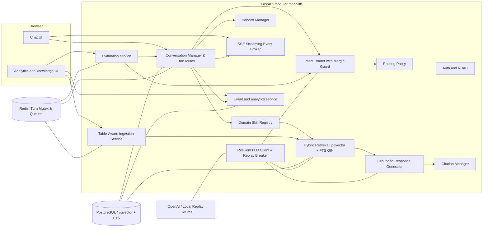
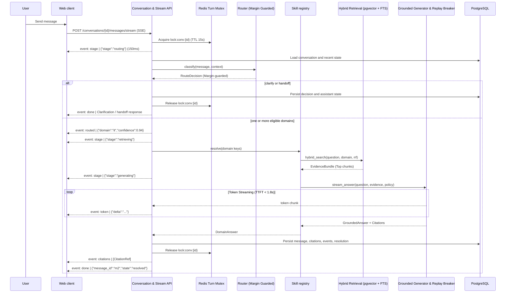

# CampusOne — System Architecture

## 1. Architecture decision

CampusOne uses a **modular monolith**: one FastAPI application owns orchestration and APIs, one Next.js application owns the web UI, PostgreSQL with pgvector owns durable state and vector retrieval, and Redis is used for short-lived locks and ingestion/evaluation jobs. The modules are separated in code and tested independently, but they are deployed with the smallest number of operational units that still supports the prototype.

This balances hackathon delivery speed with clean future seams. A future domain, retrieval backend, identity provider, or ticketing integration can be added behind an interface without changing the public chat contract.

## 2. Context diagram



## 3. Container architecture



## 4. Backend module boundaries

| Module | Owns | Does not own |
|---|---|---|
| `api` | HTTP validation, SSE streaming protocols, auth wiring, status codes | business routing logic |
| `auth` | provider abstraction, token validation, role checks | conversation ownership decisions outside the current user |
| `conversation` | turn lifecycle, Redis turn mutex, optimistic versioning, state transitions | domain-specific facts |
| `routing` | candidate intents, margin-guarded confidence, topic switches | answer generation |
| `skills` | registry, micro-drafts, domain-specific retrieval filters | global conversation state |
| `retrieval` | hybrid pgvector HNSW + FTS GIN, RRF ranking, relevance filtering | choosing the user-facing wording |
| `generation` | grounded structured answer from evidence, streaming tokens | deciding which domain owns the message |
| `citation` | stable citation objects and coverage validation | document parsing |
| `handoff` | fallback policy, summary, queue record | agent's external ticket system |
| `analytics` | event schema, aggregation queries | changing a routing decision after the fact |
| `evaluation` | fixtures, runners, metric calculations | production conversation mutation |
| `db` | SQLAlchemy models, sessions, migrations, full-text indexes | domain policy |
| `config` | typed environment settings | hidden defaults in feature modules |

## 5. Request lifecycle & streaming events



## 6. Core interfaces

The following Python-like contracts are normative. Concrete implementations may use Pydantic models, dataclasses, or typed protocols, but field meanings and invariants must remain stable.

```python
class SkillDependencies(Protocol):
    retriever: Retriever
    generator: ResponseGenerator
    llm_client: ResilientLLMClient
    settings: AppSettings

class DomainSkill(Protocol):
    key: str
    version: str

    def describe(self) -> SkillDescriptor: ...
    async def answer(
        self,
        request: SkillRequest,
        dependencies: SkillDependencies,
    ) -> DomainAnswer: ...
    async def health(self) -> SkillHealth: ...

class IntentRouter(Protocol):
    async def classify(
        self, message: str, context: RoutingContext
    ) -> RouteDecision: ...

class Retriever(Protocol):
    async def search(self, query: str, scope: RetrievalScope) -> EvidenceBundle: ...

class ResponseGenerator(Protocol):
    async def generate(
        self, request: GenerationRequest
    ) -> GroundedAnswer: ...
```

## 7. Data ownership

- PostgreSQL is the source of truth for conversations, messages, decisions, documents, chunks, events, handoffs, feedback, and evaluation runs.
- Redis is not a source of truth. It holds locks, rate-limit counters, and queued job metadata.
- OpenAI responses are transient dependencies. Store model name, latency, token counts if available, and request correlation metadata—not prompts containing unnecessary PII.
- The frontend stores only access-token/session state and an optimistic view of the current conversation. It refetches authoritative state after a response.

## 8. Configuration shape

```dotenv
APP_ENV=local
API_BASE_URL=http://localhost:8000
DATABASE_URL=postgresql+asyncpg://campusone:campusone@db:5432/campusone
REDIS_URL=redis://redis:6379/0
OPENAI_API_KEY=replace-me
OPENAI_CHAT_MODEL=gpt-4.1-mini
OPENAI_ROUTER_MODEL=gpt-4.1-mini
OPENAI_EMBEDDING_MODEL=text-embedding-3-small
ROUTING_HIGH_THRESHOLD=0.75
ROUTING_LOW_THRESHOLD=0.45
ROUTING_MAX_DOMAINS=3
CLARIFICATION_MAX_ATTEMPTS=2
HANDOFF_AFTER_FAILED_TURNS=3
RETRIEVAL_TOP_K=8
RETRIEVAL_MIN_SCORE=0.65
JWT_SECRET=local-only-secret
KNOWLEDGE_STORAGE_PATH=./knowledge
LOG_LEVEL=INFO
```

All settings are loaded by one typed settings object. Environment names are examples; deployment secrets must use the platform's secret manager.

## 9. Resilience and degradation

| Failure | Behavior |
|---|---|
| OpenAI unavailable during routing | Use deterministic lexical/embedding fallback if available; otherwise hand off with `router_unavailable`. |
| OpenAI unavailable during answer generation | Return a clear temporary-unavailable message and offer handoff; do not use ungrounded prose. |
| Database unavailable | Health check is unhealthy; no request claims success. |
| Redis unavailable | Synchronous ingestion/evaluation may run only if explicitly enabled; chat remains independent of Redis. |
| No retrieval evidence | `no_evidence` fallback; never pass empty evidence to a factual generation prompt. |
| Conflicting published evidence | `conflicting_knowledge` handoff, with source references stored. |

## 10. Observability

Every request carries `request_id`; every turn has `conversation_id`, `user_id_hash`, and `message_id`. JSON logs include event name, duration, outcome, domain keys, and error code. They exclude message text by default, access tokens, API keys, full prompts, and retrieved document bodies. See [12 Security](12_Security.md) and [11 Analytics](11_Analytics_and_Evaluation.md).

## 11. Architectural acceptance criteria

- A new domain skill can be registered through configuration and a module implementing `DomainSkill`.
- The chat route never imports a concrete `ITSkill` or `FinanceSkill` directly.
- Retrieval cannot cross a domain boundary unless an explicit multi-domain scope is supplied.
- Every assistant response has a typed outcome (`answered`, `clarification`, `handoff`, or `error`) and persisted event trail.
- Integration tests can replace OpenAI, embeddings, retrieval, and identity with deterministic fakes.

