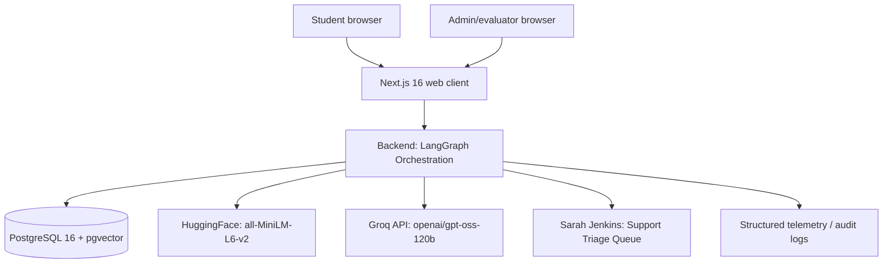
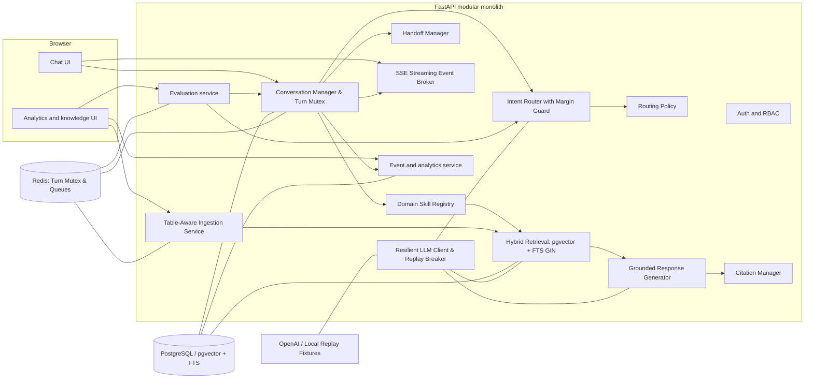
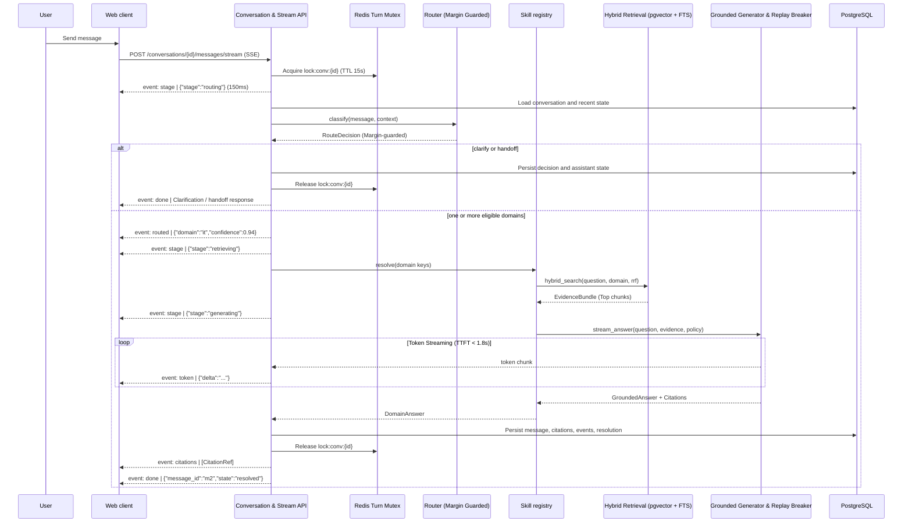

# CampusOne — System Architecture

## 1. Architecture decision

CampusOne uses a **modular LangGraph-driven monolith**: a Python backend orchestrates multi-agent conversation graphs (`graph_nodes.py`, `graph_state.py`) with high-throughput Groq LLMs (`openai/gpt-oss-120b`), a Next.js 16 application owns the multi-persona web UI, and PostgreSQL 16 with `pgvector` hosts department-isolated vector stores (`it_knowledge`, `hr_knowledge`, `finance_knowledge`, `facilities_knowledge`) with Max Marginal Relevance (MMR) retrieval. 

This balances hackathon delivery speed with clean, decoupled seams. Department skills, vector collections, or human handoff queues can be evolved independently without impacting the conversational front door.

## 2. Context diagram



## 3. Container architecture



## 4. Backend module boundaries & File Mappings

| Module / File | Owns | Does not own | Implementation |
|---|---|---|---|
| `graph_nodes.py` | State graph nodes (`router`, `it_query`, `hr_agent`, `clarify`, `synthesize`, `respond`) | Raw SQL queries, PDF loading | LangChain + ChatGroq (`openai/gpt-oss-120b`) |
| `graph_state.py` | TypedDict schemas (`AssistantState`) & Pydantic models (`DepartmentRoute`, `RetrievedDocument`, `ITQueryResponse`) | Network transport or DB sessions | Pydantic v2 + Typing |
| `knowledge_retrieval.py` | PGVector connections, HuggingFace embeddings (`all-MiniLM-L6-v2`), MMR search | Presentation formatting for UI | `langchain_postgres` + `HuggingFaceEmbeddings` |
| `index_documents.py` | PDF parsing (`PyPDFLoader`), recursive character chunking (1000/150), collection seeding | Answering chat queries | `langchain_community` + `RecursiveCharacterTextSplitter` |
| `Prompts.py` | Department-specific system prompts and grounding instructions | Runtime state transitions | Python string templates |
| `docker-compose.yml` | PostgreSQL 16 + pgvector container runtime (`campus-one-postgres`) | Application-level graph logic | Docker Compose v2 |

## 5. Request lifecycle & streaming events



## 6. Core interfaces

The following Python-like contracts are normative. Concrete implementations may use Pydantic models, dataclasses, or typed protocols, but field meanings and invariants must remain stable.

```python
class SkillDependencies(Protocol):
    retriever: Retriever
    generator: ResponseGenerator
    llm_client: ResilientLLMClient
    settings: AppSettings

class DomainSkill(Protocol):
    key: str
    version: str

    def describe(self) -> SkillDescriptor: ...
    async def answer(
        self,
        request: SkillRequest,
        dependencies: SkillDependencies,
    ) -> DomainAnswer: ...
    async def health(self) -> SkillHealth: ...

class IntentRouter(Protocol):
    async def classify(
        self, message: str, context: RoutingContext
    ) -> RouteDecision: ...

class Retriever(Protocol):
    async def search(self, query: str, scope: RetrievalScope) -> EvidenceBundle: ...

class ResponseGenerator(Protocol):
    async def generate(
        self, request: GenerationRequest
    ) -> GroundedAnswer: ...
```

## 7. Data ownership

- PostgreSQL is the source of truth for conversations, messages, decisions, documents, chunks, events, handoffs, feedback, and evaluation runs.
- Redis is not a source of truth. It holds locks, rate-limit counters, and queued job metadata.
- OpenAI responses are transient dependencies. Store model name, latency, token counts if available, and request correlation metadata—not prompts containing unnecessary PII.
- The frontend stores only access-token/session state and an optimistic view of the current conversation. It refetches authoritative state after a response.

## 8. Configuration shape

```dotenv
APP_ENV=local
API_BASE_URL=http://localhost:8000
DATABASE_URL=postgresql+asyncpg://campusone:campusone@db:5432/campusone
REDIS_URL=redis://redis:6379/0
OPENAI_API_KEY=replace-me
OPENAI_CHAT_MODEL=gpt-4.1-mini
OPENAI_ROUTER_MODEL=gpt-4.1-mini
OPENAI_EMBEDDING_MODEL=text-embedding-3-small
ROUTING_HIGH_THRESHOLD=0.75
ROUTING_LOW_THRESHOLD=0.45
ROUTING_MAX_DOMAINS=3
CLARIFICATION_MAX_ATTEMPTS=2
HANDOFF_AFTER_FAILED_TURNS=3
RETRIEVAL_TOP_K=8
RETRIEVAL_MIN_SCORE=0.65
JWT_SECRET=local-only-secret
KNOWLEDGE_STORAGE_PATH=./knowledge
LOG_LEVEL=INFO
```

All settings are loaded by one typed settings object. Environment names are examples; deployment secrets must use the platform's secret manager.

## 9. Resilience and degradation

| Failure | Behavior |
|---|---|
| OpenAI unavailable during routing | Use deterministic lexical/embedding fallback if available; otherwise hand off with `router_unavailable`. |
| OpenAI unavailable during answer generation | Return a clear temporary-unavailable message and offer handoff; do not use ungrounded prose. |
| Database unavailable | Health check is unhealthy; no request claims success. |
| Redis unavailable | Synchronous ingestion/evaluation may run only if explicitly enabled; chat remains independent of Redis. |
| No retrieval evidence | `no_evidence` fallback; never pass empty evidence to a factual generation prompt. |
| Conflicting published evidence | `conflicting_knowledge` handoff, with source references stored. |

## 10. Observability

Every request carries `request_id`; every turn has `conversation_id`, `user_id_hash`, and `message_id`. JSON logs include event name, duration, outcome, domain keys, and error code. They exclude message text by default, access tokens, API keys, full prompts, and retrieved document bodies. See [12 Security](12_Security.md) and [11 Analytics](11_Analytics_and_Evaluation.md).

## 11. Architectural acceptance criteria

- A new domain skill can be registered through configuration and a module implementing `DomainSkill`.
- The chat route never imports a concrete `ITSkill` or `FinanceSkill` directly.
- Retrieval cannot cross a domain boundary unless an explicit multi-domain scope is supplied.
- Every assistant response has a typed outcome (`answered`, `clarification`, `handoff`, or `error`) and persisted event trail.
- Integration tests can replace OpenAI, embeddings, retrieval, and identity with deterministic fakes.

