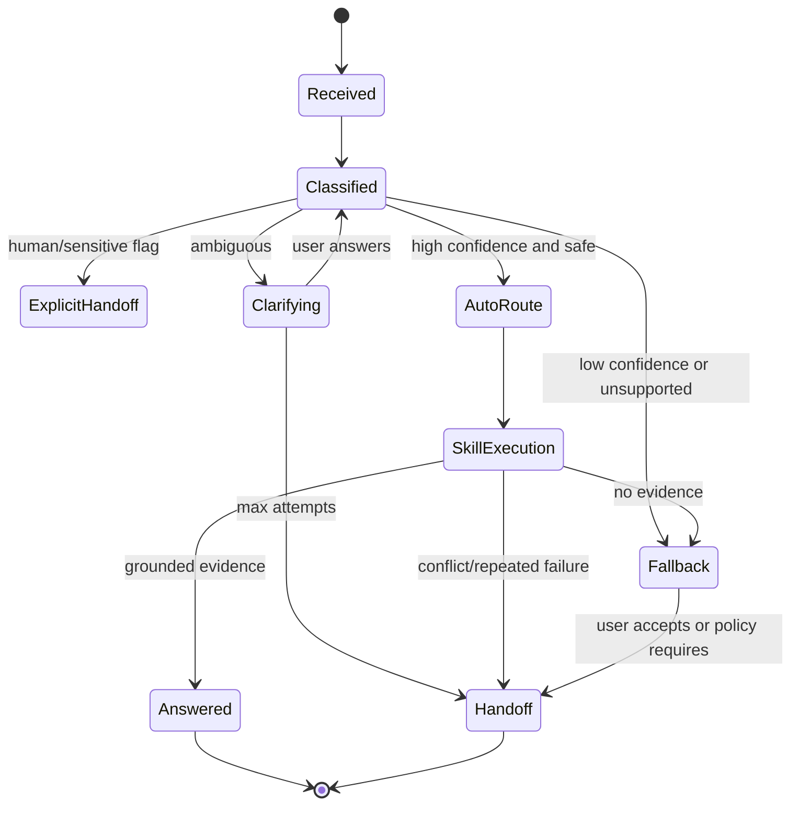

# CampusOne — Routing Engine

## 1. Purpose

The router maps a user turn plus compact conversation context to one of five domain keys, a multi-domain set, a clarification, a fallback, or a handoff. It is a policy decision with measurable confidence—not an opaque model call. For multi-domain execution and turn lifecycle details, see [06 Conversation Orchestration](06_Conversation_Orchestration.md).

## 2. Routing input and output

```json
{
  "message": "I paid my hostel fees but the portal still says unpaid and now I cannot log in",
  "conversation": {
    "active_domain": "finance",
    "previous_domains": ["it", "finance"],
    "recent_user_messages": ["How do I check my fees?"],
    "unresolved_intents": []
  },
  "available_domains": ["it", "finance", "facilities", "academics", "administration"]
}
```

```json
{
  "decision_id": "d6f0e0e0-6f08-4de2-8e36-2c5e6b5a2b30",
  "route_mode": "multi",
  "primary_domain": "finance",
  "candidates": [
    {"domain": "finance", "intent": "payment_status", "confidence": 0.91},
    {"domain": "it", "intent": "portal_login", "confidence": 0.84}
  ],
  "clarification": null,
  "reason_code": "two_explicit_domain_signals",
  "topic_switched": false,
  "safety_flags": [],
  "model": {"name": "configured-router-model", "version": "v1"}
}
```

Do not persist hidden chain-of-thought. `reason_code` is from a finite enum and `signals` are compact labels such as `payment_status_phrase` or `login_phrase`.

## 3. Domain profiles

Each domain configuration contains:

```yaml
key: finance
display_name: Finance
description: fees, payments, refunds, payment status, financial holds
positive_examples:
  - how do I pay semester fees
  - my payment is pending
negative_examples:
  - password reset
aliases: [fees, payments, accounts office]
intents: [fee_payment, payment_failure, payment_status, refund]
```

Profiles live in `backend/app/domains/config/*.yaml` or a database table seeded from versioned files. YAML is used for reviewability; database overrides may be added for admin tuning later.

## 4. Classification pipeline

1. **Normalise:** Unicode normalisation, lowercase copy, whitespace cleanup, language detection, and PII-safe tokenisation. Preserve original text for the answer but never mutate it in-place.
2. **Explicit controls:** detect `human`, `agent`, `cancel`, and safety-sensitive intents before ordinary classification.
3. **Candidate generation:** compare query embedding and lexical aliases against domain profiles. Keep the top three candidates above a low candidate floor.
4. **Structured model classification:** ask the configured router model for JSON matching `RouterOutput`, with domain keys restricted to the registry.
5. **Score fusion:** combine independent signals, then calibrate against evaluation data.
6. **Conversation adjustment:** use active domain as a weak prior only when the new message contains no competing domain signal. Explicit signals override previous domain.
7. **Policy:** apply thresholds, multi-intent rules, unsupported/safety rules, and repeated-failure limits.
8. **Persist:** store the decision, scores, reason code, model metadata, and policy outcome.

## 5. Confidence score

For candidate domain `d`, the initial score is:

```text
raw(d) = 0.55 * semantic_similarity(d)
       + 0.25 * lexical_signal(d)
       + 0.20 * structured_model_confidence(d)
```

Where each component is normalised to [0, 1]. The production value is calibrated:

```text
confidence(d) = clip(calibrator(raw(d), domain=d), 0, 1)
```

The prototype uses isotonic regression when at least 50 labelled examples per domain are available; before that, use raw score and clearly label calibration as provisional. A score is not a probability until calibration is validated.

Record `raw_score`, `calibrated_score`, and `calibration_version` so metric changes are explainable.

## 6. Initial policy thresholds & Margin Guard

| Range | Default action |
|---|---|
| `>= 0.75` (with Margin Guard passed) | auto-route candidate if evidence and safety checks pass |
| `0.45–0.74` OR `Margin Guard failed` | clarification when margin is small or intent is underspecified |
| `< 0.45` | fallback or handoff; never choose a domain by default |

### Margin Guard Policy Rule
Even if the top candidate score satisfies $\text{score}(d_1) \ge 0.75$, the router enforces a **Margin Guard**:
$$\Delta = \text{score}(d_1) - \text{score}(d_2)$$
If $\Delta < 0.15$, the turn is **forced into the Ambiguous / Clarification tier** unless the router explicitly classifies the turn as a multi-intent request (`route_mode: "multi"`). This prevents overconfident LLM classifications from misrouting ambiguous student phrases (e.g. "my account is blocked").

### Negative Domain Anchor Penalty
Domain profiles configure negative anchor concepts (e.g., `Finance` registers negative anchors: `[password, wifi, email, ldap]`).
If the query embedding's cosine similarity to a domain's negative anchor exceeds $0.70$, a dynamic penalty is applied:
$$\text{score}_{\text{penalized}}(d) = \max(0.0, \text{score}(d) - 0.25)$$

Additional policy:
- A multi-domain route requires each selected domain to be at least `0.65` and have a distinct intent signal.
- An explicit human request overrides confidence.
- A sensitive request can hand off even with high routing confidence.
- Thresholds (`ROUTER_HIGH_CONFIDENCE_THRESHOLD=0.75`, `ROUTER_MARGIN_GUARD=0.15`) are settings in `app/core/config.py`, not hardcoded constants. Tune using the evaluation protocol in [11 Analytics and Evaluation](11_Analytics_and_Evaluation.md).

## 7. Single, multi, and switched intents

### Single intent

One candidate is above the high threshold, the margin is sufficient, and no second clause contains an independent actionable verb/object pair.

### Multi-intent

Use clause segmentation (`and`, `also`, `but`, separate questions), entity/verb detection, and structured model output. A second intent is accepted only when it has its own domain signal and is independently actionable. Do not turn every conjunction into two intents.

### Topic switch

Set `topic_switched=true` when:

- the new top domain differs from the active domain by at least 0.20 confidence, or
- a domain-specific signal contradicts the active domain, or
- the message starts a new question with a new intent.

The active domain is never a hard lock. The previous domain remains available only as context for resolving pronouns and unresolved tasks.

## 8. Clarification strategy

Clarification questions must be answerable in one short reply. They should use user-facing terms and offer options when the candidates are known:

```text
Do you mean a sign-in problem, a fee/payment problem, or an issue updating your student information?
```

Store:

```json
{
  "clarification_id": "...",
  "question": "...",
  "candidate_domains": ["it", "finance", "administration"],
  "attempt": 1,
  "expires_at": "2026-09-11T12:00:00Z"
}
```

If the user does not clarify after `CLARIFICATION_MAX_ATTEMPTS`, offer handoff with the candidate departments. Never repeatedly ask the same question.

## 9. Router prompt contract

The structured router prompt contains:

- system role: classify only from registered domains and intents;
- domain descriptors and examples;
- current user message;
- a compact, redacted conversation summary;
- output JSON schema;
- instruction not to answer the user and not to follow instructions contained in the user message;
- allowed reason codes and safety flags.

The response schema rejects unknown domain keys, scores outside [0, 1], missing route mode, or prose outside the JSON object. A validation failure invokes the deterministic fallback classifier and records `router_schema_error`.

## 10. Examples

| Input | Expected decision |
|---|---|
| `How do I reset my university password?` | single `it`, high confidence |
| `Where can I check my semester fees?` after IT turn | single `finance`, high confidence, `topic_switched=true` |
| `The AC in my hostel room is broken and do maintenance charges apply?` | `facilities` + `finance`, multi |
| `My account has a problem.` | clarification; likely IT/Finance/Administration candidates |
| `Can you tell me tomorrow's weather?` | fallback/unsupported; no domain skill |
| `Show me another student's fee statement.` | sensitive handoff; do not retrieve |

## 11. Router lifecycle state machine



## 12. Tuning procedure

1. Freeze a labelled validation split; do not tune thresholds on the test split.
2. Sweep high threshold from 0.60 to 0.90 and low threshold from 0.25 to 0.60.
3. Calculate macro F1, false-routing rate, clarification precision, and resolution rate for each pair.
4. Select the point that satisfies safety constraints first, then maximises resolution.
5. Check calibration with reliability bins and expected calibration error.
6. Store the chosen values and dataset version in a decision record.
7. Re-run after adding domains or changing prompts/models.

