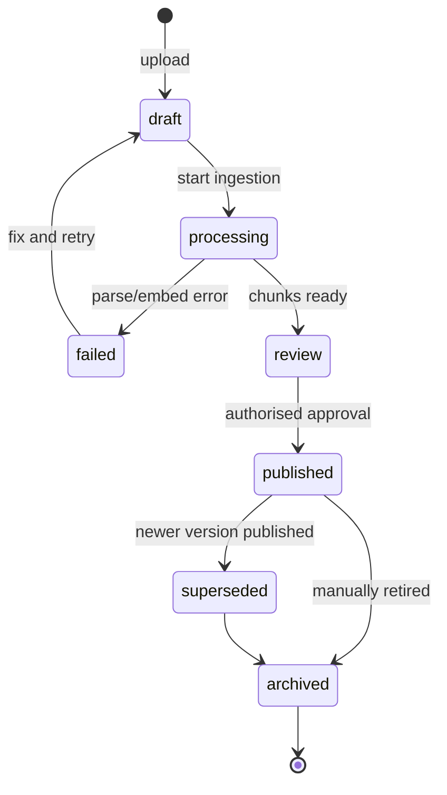

# CampusOne — RAG and Knowledge Base

## 1. Grounding policy

The language model is a formatter and reasoner over approved evidence; it is not the university source of truth. A factual claim about university policy, dates, fees, office process, eligibility, or contacts must be traceable to one or more published knowledge chunks. If evidence is absent, below the relevance threshold, stale, role-inaccessible, or contradictory, the response is a safe no-answer or handoff.

## 2. Source lifecycle



Only `published` documents that are inside their effective date and not expired are eligible for ordinary retrieval. A document may be visible to administrators while excluded from user answers.

## 3. Supported source format

The prototype accepts PDF, Markdown, plain text, and DOCX. Every upload has a sidecar metadata object or form fields:

```json
{
  "domain": "finance",
  "title": "Fee Payment and Refund Policy",
  "source_uri": "https://intranet.example/policies/fees-2026.pdf",
  "document_type": "policy",
  "owner_department": "Finance Office",
  "version_label": "2026.1",
  "effective_from": "2026-07-01",
  "effective_until": "2027-06-30",
  "audience_roles": ["student", "support_agent"],
  "language": "en",
  "approved_by": "finance-admin@example.edu"
}
```

Required metadata: `domain`, `title`, `document_type`, `version_label`, `effective_from`, `audience_roles`, and a stable source reference. Missing fields fail validation before parsing.

## 4. Ingestion pipeline

```mermaid
flowchart LR
    A[Upload source + metadata] --> B[Validate type and access]
    B --> C[Extract text and page/heading markers]
    C --> D[Normalise whitespace and preserve provenance]
    D --> E[Chunk by heading and token budget]
    E --> F[Generate embeddings]
    F --> G[Quality checks]
    G --> H[Review / publish]
    H --> I[Eligible retrieval collection]
```



Implementation steps:

1. Create a `knowledge_documents` row in `draft`.
2. Parse the source using PyMuPDF for PDF, `python-docx` for DOCX, and standard parsers for Markdown/text.
3. Preserve page number, heading path, character offsets, and source URI.
4. Remove repeated headers/footers only when the parser can prove they repeat; retain policy wording.
5. **Table-Aware Semantic Chunking:** Detect markdown and HTML tables before splitting. Do not slice tabular fee schedules or exam timetables across token boundaries. Retain tables as atomic chunks, prepending the document title and column schema as breadcrumbs. Target 450 tokens with 60-token overlap for prose; never split a numbered procedure step from its heading.
6. Generate embeddings in batches. Store model and dimension with every chunk.
7. Reject empty chunks, duplicate content within the same version, and chunks over 900 tokens after fallback splitting.
8. Run a retrieval smoke test using the document's declared sample questions.
9. Mark `review` and require an authorised publish operation. Publish is transactional: all chunks and embeddings become eligible together.

The ingestion worker is idempotent on `(document_id, content_sha256, embedding_model)`. A retry cannot duplicate chunks.

## 5. Chunk and embedding rules

Chunk text includes a breadcrumb prefix for retrieval context:

```text
[Fee Payment and Refund Policy > Failed or pending payments]
If a payment is deducted but the portal remains pending, the student should...
```

The stored `content` excludes synthetic prefixes if a clean citation excerpt is preferred; `retrieval_text` stores the exact embedded text. Use `sentence-transformers/all-MiniLM-L6-v2` (dimension 384) with normalized embeddings by default, matching the live vector pipeline in `backend/knowledge_retrieval.py`.

### Implemented Department Vector Collections

The backend maintains four department-isolated vector collections inside PostgreSQL 16 (`pgvector`):

| Domain | Collection Identifier | Ingestion Source Path | Search Strategy |
|:---|:---|:---|:---|
| **IT** | `it_knowledge` | `backend/Documents/IT/*.pdf` | MMR ($k=4, \lambda=0.7$) |
| **HR** | `hr_knowledge` | `backend/Documents/HR/*.pdf` | MMR ($k=4, \lambda=0.7$) |
| **Finance** | `finance_knowledge` | `backend/Documents/Finance/*.pdf` | MMR ($k=4, \lambda=0.7$) |
| **Facilities** | `facilities_knowledge` | `backend/Documents/Facilities/*.pdf` | MMR ($k=4, \lambda=0.7$) |

Ingestion is executed via `python backend/index_documents.py`, which loads PDFs using `PyPDFLoader`, performs recursive chunking (1,000 characters with 150-character overlap), and injects chunk metadata (`source`, `page`, `chunk_index`, `department`).

## 6. Retrieval Algorithm & PGVector Implementation

```python
scope = RetrievalScope(
    domains=["finance"],
    user_role="student",
    as_of=now,
    only_published=True,
)
semantic = vector_search(query_embedding, scope, limit=12)
lexical = full_text_search(query, scope, limit=8)
merged = reciprocal_rank_fusion(semantic, lexical)
reranked = rerank(merged[:12], query, max_items=8)
evidence = [x for x in reranked if x.score >= settings.retrieval_min_score]
```

### PostgreSQL Hybrid Search SQL Query
Executed directly in PostgreSQL using pgvector and a GIN index on `to_tsvector('english', retrieval_text)`:

```sql
WITH semantic_search AS (
  SELECT c.id, ROW_NUMBER() OVER (ORDER BY c.embedding <=> :query_vector) AS rank
  FROM knowledge_chunks c
  JOIN knowledge_documents d ON c.document_id = d.id
  WHERE d.domain = :domain 
    AND d.status = 'published'
    AND d.effective_from <= NOW()
    AND (d.effective_until IS NULL OR d.effective_until > NOW())
  LIMIT 15
),
lexical_search AS (
  SELECT c.id, ROW_NUMBER() OVER (ORDER BY ts_rank(c.text_search_vector, plainto_tsquery('english', :query_text)) DESC) AS rank
  FROM knowledge_chunks c
  JOIN knowledge_documents d ON c.document_id = d.id
  WHERE d.domain = :domain 
    AND d.status = 'published'
    AND c.text_search_vector @@ plainto_tsquery('english', :query_text)
  LIMIT 15
)
SELECT COALESCE(s.id, l.id) AS chunk_id,
       c.content, c.metadata, c.document_id,
       COALESCE(0.6 / (60 + s.rank), 0.0) + COALESCE(0.4 / (60 + l.rank), 0.0) AS rrf_score
FROM semantic_search s
FULL OUTER JOIN lexical_search l ON s.id = l.id
JOIN knowledge_chunks c ON c.id = COALESCE(s.id, l.id)
ORDER BY rrf_score DESC
LIMIT :top_k;
```

Search filters apply before ranking:
- published document;
- matching domain collection;
- effective date contains `as_of`;
- audience role includes the current role;
- non-archived document;
- approved language;
- optional source type or intent filter.

Do not widen the domain filter merely because the top result is weak. The orchestrator can issue a second explicitly cross-domain query for a multi-intent request.

## 7. Evidence bundle

```json
{
  "query": "payment deducted but portal shows unpaid",
  "domain": "finance",
  "as_of": "2026-09-11T06:30:00Z",
  "items": [
    {
      "chunk_id": "2d6...",
      "document_id": "a31...",
      "score": 0.86,
      "title": "Fee Payment and Refund Policy",
      "section": "Failed or pending payments",
      "page": 4,
      "excerpt": "...",
      "source_uri": "https://intranet.example/policies/fees-2026.pdf",
      "version_label": "2026.1",
      "effective_from": "2026-07-01",
      "effective_until": "2027-06-30"
    }
  ],
  "coverage": {"has_evidence": true, "min_score": 0.86, "conflicts": []}
}
```

The generator receives item IDs and text excerpts, never an unbounded document dump. Limit the total evidence context to a configured token budget, default 5,000 tokens.

## 8. Answerability and relevance

An evidence bundle is answerable when:

1. it contains at least one item above `RETRIEVAL_MIN_SCORE`;
2. the item domain matches the skill;
3. the evidence text directly addresses the detected intent;
4. no active document conflict exists for the requested fact;
5. the user role is allowed to see it.

The response generator returns claim-level citation references. A validator rejects an `answered` result if any factual sentence lacks a citation or if the citation points to an evidence item not in the bundle.

## 9. Citation model and UI behavior

Each citation contains `citation_id`, `document_id`, `title`, `section`, `page`, `version_label`, `source_uri`, and a short excerpt. The assistant response uses inline markers `[1]`, `[2]`; the UI renders those markers as expandable cards. Citations from several domains are grouped by sub-answer and labelled with the source department, while the experience remains one assistant.

Never display a source URI a student is not authorised to open. The UI can show the title, section, and approved public/intranet link; access checks happen server-side.

## 10. No-answer policy

Use one of these outcomes:

- **Clarify:** evidence may exist but the user request is underspecified.
- **Unavailable:** no approved evidence answers the question; provide the owning office and next action.
- **Handoff:** the request is sensitive, conflicting, repeated, or requires account-specific action.

Approved no-answer copy:

```text
I could not find an approved university source that answers that specific question. I do not want to guess. I can connect you with {department}, or you can rephrase the request with {useful detail}.
```

## 11. Stale documents and versioning

- A newer version is published before the old version is superseded so there is no retrieval gap.
- `effective_until` is enforced at query time.
- A nightly job reports documents expiring within 30 days and chunks with no current document.
- Superseded content remains for audit/evaluation but is excluded from production retrieval.
- Every citation includes version label and effective dates.

## 12. Prompt injection and poisoned sources

Ingestion flags chunks containing instructions addressed to the model, requests for secrets, or role-changing language. Flagged chunks require administrator review and can be excluded from retrieval. At generation time, evidence is wrapped as untrusted data, and the domain prompt explicitly says to ignore embedded instructions. A user cannot publish a knowledge document through chat.

## 13. Knowledge quality gates

Before publishing a document:

- parse success and non-empty text;
- metadata completeness;
- no duplicate chunk within version;
- embedding success for every chunk;
- at least three smoke queries with a relevant top-three result;
- citation metadata present;
- reviewer and timestamp recorded.

## 14. Acceptance criteria

- A published Finance policy is retrieved for a Finance question and not for a password question.
- A superseded policy cannot appear in a new answer.
- An empty collection produces no factual answer.
- A citation opens or displays the exact source metadata used.
- Two documents with conflicting effective policies trigger the conflict path.
## 15. Seed corpus strategy

The demo's credibility depends on realistic, detailed seed documents. Generic placeholder text undermines the entire grounding story.

### Content targets per domain

| Domain | Priority | Min documents | Min chunks | Required coverage for demo |
|---|---:|---:|---:|---|
| `it` | 1 | 2 | 10 | Password reset SOP, portal login troubleshooting |
| `finance` | 1 | 2 | 12 | Fee payment policy with reconciliation SLA (24–48h), refund process |
| `facilities` | 2 | 1 | 6 | Hostel maintenance reporting, AC/electrical repair process |
| `academics` | 2 | 1 | 6 | Attendance policy (75% rule), exam schedule process |
| `administration` | 2 | 1 | 6 | Bonafide certificate request, document request procedure |

Priority 1 domains are exercised in the demo Steps 1–4. Priority 2 domains must exist for routing accuracy but need less depth.

### Document detail guidelines

Each seed document must contain:

- **Specific numbers and SLAs:** "24 to 48 banking hours," "75% minimum attendance," "₹500 late fee after 15 September." Vague language ("contact the office") weakens the grounding demonstration.
- **Named processes with steps:** numbered procedures a student can follow, not abstract descriptions.
- **Contact details:** department name, email, office hours, building/room. These are cited in no-evidence handoffs.
- **Edge cases and exceptions:** at least one "if this fails, do that" branch per document to support follow-up questions.
- **Effective dates and version labels:** realistic values matching the current academic year so date filters behave correctly during the demo.

Target length: 800–1,500 words per document. This produces 8–15 chunks at the 450-token target, enough for retrieval diversity without overwhelming the context budget.

### Seed document template

```markdown
# [Document Title]

**Domain:** [domain key]
**Version:** [version_label, e.g. 2026.1]
**Effective From:** [YYYY-MM-DD]
**Effective Until:** [YYYY-MM-DD or "Until superseded"]
**Audience:** [student | student, staff | student, support_agent]
**Owner Department:** [Department Name (email)]

## [Section 1: Core Process]

[Numbered steps with specific details, SLAs, and exception branches.]

## [Section 2: Troubleshooting / Common Issues]

[Table or list of symptoms → actions → escalation paths.]

## [Section 3: Contact and Escalation]

[Office name, hours, email, phone, building. Emergency vs. standard process.]
```

### Demo-critical content

The following specific facts must appear in seed documents because the demo script references them:

| Demo step | Required fact | Source document |
|---|---|---|
| Step 1 (IT password) | Self-service reset portal URL, identity verification step | `it/password_and_portal.md` |
| Step 2 (Fees) | Fee schedule portal path, payment methods | `finance/fee_payment_schedule.md` |
| Step 3 (Payment pending) | 24–48 hour NEFT/RTGS clearing SLA, UTR verification steps | `finance/refund_and_reconciliation.md` |
| Step 4 (Portal lockout) | Financial hold policy blocking portal access | `finance/fee_payment_schedule.md` + `it/password_and_portal.md` |
| Step 5 (Ambiguous) | Enough overlap in IT/Finance/Admin "account" vocabulary to trigger clarification | Domain profiles, not source docs |
| Step 6 (Submarine) | No matching content anywhere | Verified by empty retrieval |

