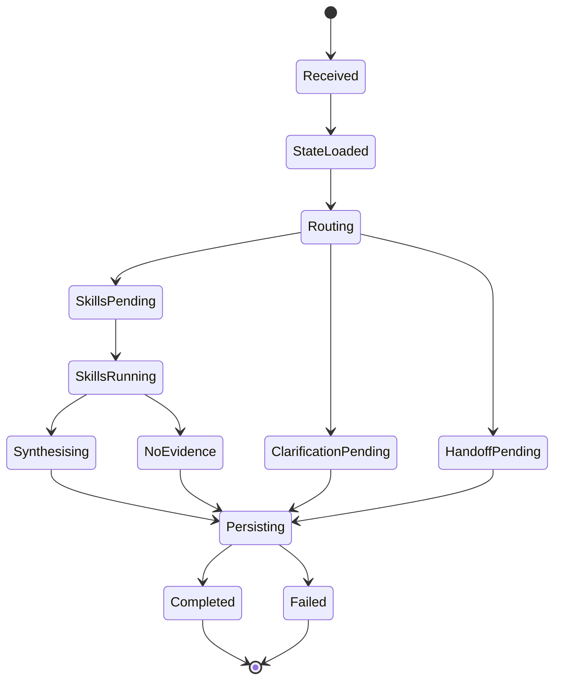
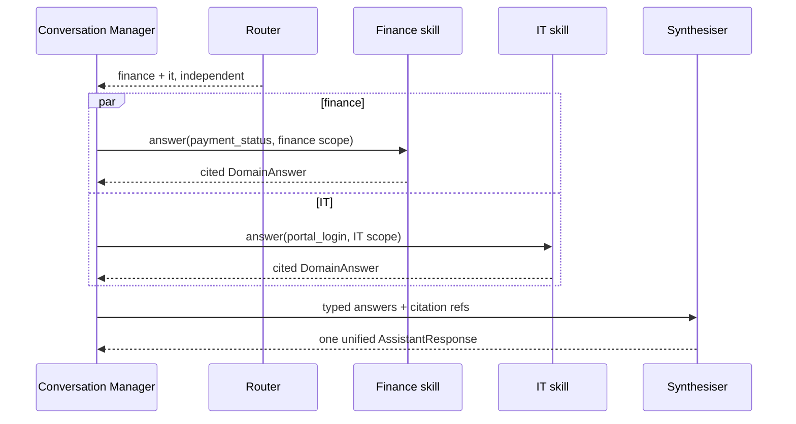

# CampusOne — Conversation Orchestration

## 1. Responsibility

The Conversation Manager owns the turn lifecycle. It loads state, invokes the router, chooses a policy path, coordinates domain skills, synthesises a unified response, persists the outcome, and emits analytics. It does not classify by itself and does not contain domain facts.

## 2. Conversation state

```json
{
  "conversation_id": "4b4b1f2d-42fd-4da6-8933-0b7e72cc3a55",
  "user_id": "student-001",
  "status": "open",
  "active_domain": "finance",
  "previous_domains": ["it", "finance"],
  "unresolved_intents": ["portal_login"],
  "clarification": null,
  "resolution_state": "open",
  "handoff_state": "none",
  "summary": "Student asked about a payment showing unpaid and then reported portal login trouble.",
  "summary_version": 3
}
```

Messages are append-only. Derived fields such as `active_domain` and `summary` are updated transactionally with the assistant turn and can be rebuilt from persisted events if needed.

## 3. Turn state machine



## 4. Turn algorithm & Concurrency Control

```python
async def process_turn(command: SendMessage, user: CurrentUser) -> AssistantTurn:
    conversation = await conversations.require_owned(command.conversation_id, user)
    idempotent = await turns.find_by_key(command.idempotency_key)
    if idempotent:
        return idempotent.response

    # 1. Acquire distributed Turn Mutex (15-second lease)
    lock_key = f"lock:conversation:{conversation.id}"
    lock_acquired = await redis.set(lock_key, user.id, nx=True, ex=15)
    if not lock_acquired:
        raise TurnConflictError("Another turn is currently being processed for this conversation.")

    try:
        user_message = await messages.append_user(conversation, command.text)
        context = context_builder.for_routing(conversation, max_messages=8)
        decision = await router.classify(command.text, context)
        await routing_store.save(decision, user_message.id)

        if decision.route_mode == "clarify":
            response = clarification_manager.create(decision, conversation)
        elif decision.route_mode in {"fallback", "handoff"}:
            response = await handoff_manager.handle_or_offer(decision, conversation)
        else:
            answers = await skill_orchestrator.run(decision, conversation, user_message)
            response = await synthesiser.combine_micro_drafts(answers, conversation)

        # Optimistic concurrency check on conversation.version
        await persist_turn_atomically(response, decision, conversation, expected_version=conversation.version)
        await analytics.emit_for_turn(...)
        return response
    finally:
        await redis.delete(lock_key)
```

The database transaction wraps message/decision/response persistence with an optimistic concurrency check (`UPDATE conversations SET version = version + 1 WHERE id = :id AND version = :expected_version`). If another process updated the conversation concurrently, the transaction fails and prompts an automated client refresh.

## 5. Context construction

Context has three layers:

1. **Routing context:** active/previous domains, unresolved intents, recent user messages, clarification state, and a short summary. It excludes old citations and irrelevant assistant prose.
2. **Skill context:** the current user question, resolved intent, only the necessary recent turns, and cross-domain outputs explicitly approved by the orchestrator.
3. **Synthesis context:** compact domain answers, their citations, and any unresolved questions. It does not receive hidden model reasoning.

Use a token budget:

| Context | Default budget |
|---|---:|
| Router | 2,000 tokens |
| One skill | 4,000 tokens including evidence |
| Synthesis | 4,000 tokens |

When the conversation exceeds the budget, summarise older turns with a deterministic structured summary and retain message IDs for audit.

## 6. Topic switching

After each route decision:

- append the old active domain to `previous_domains` if it changes;
- set the new primary domain only if the route is answerable or explicitly clarified;
- retain unresolved intents so a later `also` or `what about that` can resolve the right thread;
- never reuse old retrieval evidence unless it is revalidated for the new turn.

Example:

```text
Turn 1: password reset -> active_domain=it
Turn 2: semester fees -> active_domain=finance, previous_domains=[it]
Turn 3: still cannot log in -> active_domain=it, previous_domains=[it, finance]
```

## 7. Multi-domain orchestration

### Detection

The router returns ordered candidates with `intent` and optional `depends_on`. The orchestrator rejects duplicate domain/intent pairs and caps execution at three domains.

### Execution

- Independent skills run concurrently with `asyncio.gather` and per-skill timeout.
- A dependent skill runs after its prerequisite and receives a compact, typed result—not raw prompt text.
- One skill timeout does not erase another successful answer; the final response labels the incomplete subtask and offers handoff.

### Hierarchical Micro-Draft Synthesis
To prevent multi-domain context explosion and avoid the "Lost in the Middle" attention degradation, the synthesiser never ingests the raw chunk evidence from all invoked skills simultaneously (which could total 10+ chunks and 4,000+ tokens). 
Instead, a **two-tier hierarchical pattern** is enforced:
1. Each domain skill independently executes retrieval and generates a concise **Domain Micro-Draft** (1–2 sentences summarizing its resolution, grounded with its local citation refs).
2. The orchestrator collects the `DomainAnswer` micro-drafts and passes only these drafts and citation pointers to the synthesiser.
3. The synthesiser weaves the micro-drafts into a cohesive dual-issue response in $< 400$ tokens, executing in $< 800$ ms.

The synthesiser:
1. preserves the user's clause order when possible;
2. gives each issue a numbered heading or bullet;
3. does not merge incompatible policies;
4. carries each claim's citation IDs into the final response;
5. states unresolved work and next action explicitly;
6. returns `handoff` if conflicting evidence or a safety rule requires it.

### Mixed-outcome decision table

When multiple skills return different outcomes, the synthesiser applies the following precedence:

| Skill A outcome | Skill B outcome | Final response | Rationale |
|---|---|---|---|
| `answered` | `answered` | Unified response with both citation groups | Happy path; both issues resolved. |
| `answered` | `no_evidence` | Deliver A's answer; state B is unavailable with department contact and handoff offer | Don't withhold a good answer because a sibling failed. |
| `answered` | `handoff` | Deliver A's answer; attach B's handoff banner with reason | Partial resolution is better than full escalation. |
| `answered` | `timeout` | Deliver A's answer; label B as incomplete with retry/handoff offer | Timeout does not erase successful work. |
| `no_evidence` | `no_evidence` | Combined no-answer with both department contacts; offer handoff | Neither domain can help; escalate. |
| `no_evidence` | `handoff` | Handoff with both reason codes | Escalate to the more specific department. |
| `handoff` | `handoff` | Single handoff with merged reason codes and both departments | Avoid creating two separate tickets. |
| `clarification` | any | Clarification takes priority; defer the resolved skill's answer to the next turn | Ambiguity must be resolved before delivering partial answers that may be wrong. |
| any | `conflicting_knowledge` | Immediate handoff with conflict reason and all citation IDs | Safety rule: never silently pick one side of a conflict. |

The synthesiser records the per-skill outcomes in the analytics event so mixed-outcome patterns can be measured and tuned.



## 8. Conflict handling

Conflicts are detected when active evidence for the same claim has incompatible values or effective dates overlap without a precedence rule. The response says the published information is inconsistent, names the owning department, and offers handoff. It records `conflicting_knowledge` and all conflicting citation IDs.

## 9. Resolution state

Conversation resolution is separate from turn outcome:

- `open`: no accepted resolution yet;
- `resolved`: supported answer/next action met evaluation criteria or user marked resolved;
- `needs_clarification`: waiting for user information;
- `handed_off`: transferred or offered to a department;
- `unresolved`: interaction ended without sufficient answer.

The UI offers a `Mark resolved` control. Automatic resolution is allowed only when the answer is grounded, no handoff is required, and the evaluation rubric for the intent permits a procedural answer.

## 10. Concurrency and idempotency

- Client sends an idempotency key per message submit.
- Backend enforces unique `(conversation_id, idempotency_key)`.
- Per-conversation advisory lock or Redis lock prevents out-of-order assistant turns.
- A stale conversation version returns `409 conversation_version_conflict`; the client refetches and lets the user retry.
- Background analytics retries are idempotent on `(event_type, aggregate_id, event_version)`.

## 11. Acceptance criteria

- Two users cannot read or mutate the same private conversation.
- A second submit with the same idempotency key returns the original response without a duplicate message.
- IT → Finance topic switching updates active domain and retrieval scope.
- Finance + IT produces one assistant message with both citation groups.
- A domain timeout preserves successful sub-answers and offers a clear next action.

