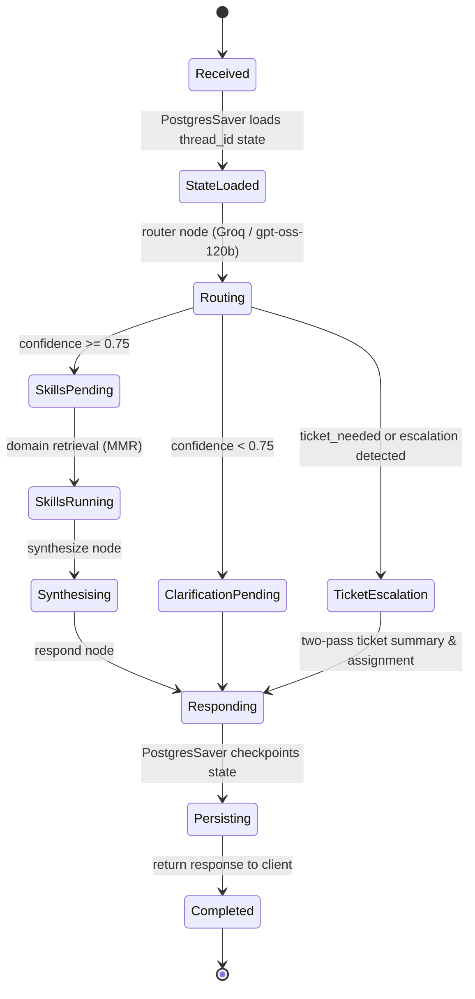
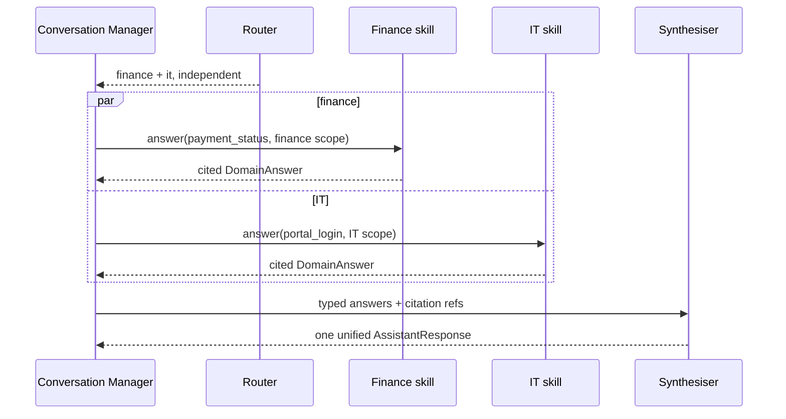

# CampusOne — Conversation Orchestration

## 1. Responsibility

The Conversation Manager owns the turn lifecycle. It loads state, invokes the router, chooses a policy path, coordinates domain skills, synthesises a unified response, persists the outcome, and emits analytics. It does not classify by itself and does not contain domain facts.

## 2. Conversation state

Conversation state is represented as `AssistantState` in `backend/graph_state.py` and serialized to PostgreSQL checkpoints via LangGraph:

```python
class AssistantState(TypedDict, total=False):
    messages: Annotated[List[Dict[str, Any]], add_messages]
    detected_domains: List[str]
    confidence: float
    reasoning: str
    clarification_question: Optional[str]
    suggested_options: List[str]
    ticket_needed: bool
    ticket_id: Optional[str]
    ticket: Optional[Dict[str, Any]]
    ticket_summary: Optional[str]
    solved: bool
    sources: List[str]
    retrieved_chunks: List[Dict[str, Any]]
    user_id: Optional[str]
    role: Optional[str]
```

### Stable Thread ID Architecture
Conversation threads are keyed hierarchically by combining the student's stable user ID and an optional session conversation ID:
$$\text{thread\_id} = \begin{cases} \text{current\_user.id} : \text{conversation\_id} & \text{if } \text{conversation\_id} \text{ is supplied} \\ \text{current\_user.id} & \text{fallback (legacy / unpartitioned)} \end{cases}$$

- **Multi-Session Isolation:** Students can maintain concurrent, distinct support inquiries (e.g. one for "Tuition refund" and one for "Dorm Wi-Fi") without message collisions or cross-contamination.
- **Cross-Login Persistence:** Because `thread_id` is rooted in the student ID (e.g., `u-student-01`), the user can log out, close their browser, log in again on any client (Web or Streamlit), and immediately resume their conversation.
- **IDOR Protection:** Clients only specify `conversation_id`. The backend enforces that the target conversation belongs to `current_user.id` before fetching from `PostgresSaver`. Arbitrary thread overrides are blocked.
- **Directory Synchronization:** Every turn touched through `POST /api/v1/chat` or `/stream` executes `touch_conversation()`, ensuring `campus_conversations` stays in lockstep across both the Next.js sidebar and Streamlit console.

## 3. Turn state machine


```mermaid
stateDiagram-v2
    [*] --> Received
    Received --> StateLoaded: PostgresSaver loads thread_id state
    StateLoaded --> Routing: router node (Groq / gpt-oss-120b)
    Routing --> ClarificationPending: confidence < 0.75
    Routing --> TicketEscalation: ticket_needed or escalation detected
    Routing --> SkillsPending: confidence >= 0.75
    SkillsPending --> SkillsRunning: domain retrieval (MMR)
    SkillsRunning --> Synthesising: synthesize node
    Synthesising --> Responding: respond node
    ClarificationPending --> Responding
    TicketEscalation --> Responding: two-pass ticket summary & assignment
    Responding --> Persisting: PostgresSaver checkpoints state
    Persisting --> Completed: return response to client
    Completed --> [*]
```

## 4. Turn algorithm & LangGraph Lifecycle

### Application Lifespan & Durable Connection Pool
The LangGraph checkpointer connects to PostgreSQL through a dedicated `psycopg_pool.ConnectionPool` configured during the FastAPI application lifespan:

```python
# backend/app/main.py
@asynccontextmanager
async def lifespan(app: FastAPI):
    configure_langsmith()  # Export LangSmith tracing environment if configured
    initialize_graph(settings.DATABASE_URL)  # Init ConnectionPool & PostgresSaver.setup()
    try:
        yield
    finally:
        close_graph()  # Drain & close connection pool on shutdown
```

```python
# backend/graph.py
def initialize_graph(database_url: str) -> None:
    global _connection_pool, _checkpointer, _graph
    if _graph is not None:
        return

    conn_string = database_url.replace("postgresql+psycopg://", "postgresql://", 1)
    _connection_pool = ConnectionPool(
        conninfo=conn_string,
        kwargs={"autocommit": True, "prepare_threshold": 0},
        open=True,
    )
    _checkpointer = PostgresSaver(_connection_pool)
    _checkpointer.setup()  # Auto-creates/migrates checkpoints tables
    _graph = build_graph(_checkpointer)
```

### Turn Execution (`POST /api/v1/chat`)
When a student posts a message, the endpoint executes the compiled graph inside a worker threadpool, preserving session context and persisting checkpoint updates:

```python
@router.post("", response_model=ChatResponse)
async def chat(
    request: ChatRequest,
    current_user: CurrentUser = Depends(require_permission("messages:create")),
) -> ChatResponse:
    graph = get_graph()
    thread_id = current_user.id

    result = await run_in_threadpool(
        graph.ainvoke,
        {
            "messages": [{"role": "user", "content": request.message}],
            "user_id": current_user.id,
            "role": current_user.role.value,
        },
        {"configurable": {"thread_id": thread_id}},
    )
    return ChatResponse(...)
```

### History Retrieval (`GET /api/v1/chat/history`)
```python
@router.get("/history", response_model=ChatHistoryResponse)
async def chat_history(
    current_user: CurrentUser = Depends(require_permission("messages:create")),
) -> ChatHistoryResponse:
    thread_id = current_user.id
    snapshot = await run_in_threadpool(
        get_graph().get_state,
        {"configurable": {"thread_id": thread_id}},
    )
    return ChatHistoryResponse(
        thread_id=thread_id,
        messages=(snapshot.values or {}).get("messages", []),
    )
```

## 5. Context construction

Context has three layers:

1. **Routing context:** active/previous domains, unresolved intents, recent user messages, clarification state, and a short summary. It excludes old citations and irrelevant assistant prose.
2. **Skill context:** the current user question, resolved intent, only the necessary recent turns, and cross-domain outputs explicitly approved by the orchestrator.
3. **Synthesis context:** compact domain answers, their citations, and any unresolved questions. It does not receive hidden model reasoning.

Use a token budget:

| Context | Default budget |
|---|---:|
| Router | 2,000 tokens |
| One skill | 4,000 tokens including evidence |
| Synthesis | 4,000 tokens |

When the conversation exceeds the budget, summarise older turns with a deterministic structured summary and retain message IDs for audit.

## 6. Topic switching

After each route decision:

- append the old active domain to `previous_domains` if it changes;
- set the new primary domain only if the route is answerable or explicitly clarified;
- retain unresolved intents so a later `also` or `what about that` can resolve the right thread;
- never reuse old retrieval evidence unless it is revalidated for the new turn.

Example:

```text
Turn 1: password reset -> active_domain=it
Turn 2: semester fees -> active_domain=finance, previous_domains=[it]
Turn 3: still cannot log in -> active_domain=it, previous_domains=[it, finance]
```

## 7. Multi-domain orchestration

### Detection

The router returns ordered candidates with `intent` and optional `depends_on`. The orchestrator rejects duplicate domain/intent pairs and caps execution at three domains.

### Execution

- Independent skills run concurrently with `asyncio.gather` and per-skill timeout.
- A dependent skill runs after its prerequisite and receives a compact, typed result—not raw prompt text.
- One skill timeout does not erase another successful answer; the final response labels the incomplete subtask and offers handoff.

### Hierarchical Micro-Draft Synthesis
To prevent multi-domain context explosion and avoid the "Lost in the Middle" attention degradation, the synthesiser never ingests the raw chunk evidence from all invoked skills simultaneously (which could total 10+ chunks and 4,000+ tokens). 
Instead, a **two-tier hierarchical pattern** is enforced:
1. Each domain skill independently executes retrieval and generates a concise **Domain Micro-Draft** (1–2 sentences summarizing its resolution, grounded with its local citation refs).
2. The orchestrator collects the `DomainAnswer` micro-drafts and passes only these drafts and citation pointers to the synthesiser.
3. The synthesiser weaves the micro-drafts into a cohesive dual-issue response in $< 400$ tokens, executing in $< 800$ ms.

The synthesiser:
1. preserves the user's clause order when possible;
2. gives each issue a numbered heading or bullet;
3. does not merge incompatible policies;
4. carries each claim's citation IDs into the final response;
5. states unresolved work and next action explicitly;
6. returns `handoff` if conflicting evidence or a safety rule requires it.

### Mixed-outcome decision table

When multiple skills return different outcomes, the synthesiser applies the following precedence:

| Skill A outcome | Skill B outcome | Final response | Rationale |
|---|---|---|---|
| `answered` | `answered` | Unified response with both citation groups | Happy path; both issues resolved. |
| `answered` | `no_evidence` | Deliver A's answer; state B is unavailable with department contact and handoff offer | Don't withhold a good answer because a sibling failed. |
| `answered` | `handoff` | Deliver A's answer; attach B's handoff banner with reason | Partial resolution is better than full escalation. |
| `answered` | `timeout` | Deliver A's answer; label B as incomplete with retry/handoff offer | Timeout does not erase successful work. |
| `no_evidence` | `no_evidence` | Combined no-answer with both department contacts; offer handoff | Neither domain can help; escalate. |
| `no_evidence` | `handoff` | Handoff with both reason codes | Escalate to the more specific department. |
| `handoff` | `handoff` | Single handoff with merged reason codes and both departments | Avoid creating two separate tickets. |
| `clarification` | any | Clarification takes priority; defer the resolved skill's answer to the next turn | Ambiguity must be resolved before delivering partial answers that may be wrong. |
| any | `conflicting_knowledge` | Immediate handoff with conflict reason and all citation IDs | Safety rule: never silently pick one side of a conflict. |

The synthesiser records the per-skill outcomes in the analytics event so mixed-outcome patterns can be measured and tuned.


```mermaid
sequenceDiagram
    participant C as Conversation Manager
    participant R as Router
    participant F as Finance skill
    participant I as IT skill
    participant S as Synthesiser
    R-->>C: finance + it, independent
    par finance
        C->>F: answer(payment_status, finance scope)
        F-->>C: cited DomainAnswer
    and IT
        C->>I: answer(portal_login, IT scope)
        I-->>C: cited DomainAnswer
    end
    C->>S: typed answers + citation refs
    S-->>C: one unified AssistantResponse
```

### Ticket Summarization, Lifecycle Management, and Safe Department Fallback

When escalation or human assistance is required, `create_ticket()` coordinates structured ticket creation:
1. **Fresh Request Detection:** When a student explicitly requests a ticket (via `"raise a ticket"`, `"bro ticket"`, etc.), `create_ticket()` triggers fresh summary generation by setting `ticket_requested: True` and resetting `ticket_summary: None`. This prevents stale session lockouts even if an earlier ticket existed on the thread.
2. **Safe Department Fallback:** To prevent runtime indexing errors when queries have ambiguous domain boundaries or empty classifications, the prompt resolves the primary department with explicit fallback:
   ```python
   department = (state.get("detected_domains") or ["General"])[0]
   ```
3. **One-Time Creation Receipt Delivery:** The system sets `ticket_just_created: True`, delivering the formal confirmation receipt (`"Your issue has been raised as internal support ticket TKT-XXXX..."`) on that single turn. On subsequent turns, `ticket_just_created` is reset to `False`, allowing specialist agents to answer conversational follow-up questions without re-delivering canned creation receipts.

### Zero-Emoji Contract & Clean Markdown Delivery

To ensure professional accessibility and visual clarity across all client interfaces:
- **Zero-Emoji Rule:** All system prompts strictly prohibit the generation of emojis (including numbered keycaps like 1️⃣, 2️⃣, and decorative symbols).
- **Deterministic List Sanitization (`_clean_content()`):** Any legacy or stray keycap numbers are automatically converted by regular expressions into standard Markdown numbered lists (`1. `, `2. `) with preceding blank lines. All other unicode emojis are stripped before delivery.

## 8. Conflict handling

Conflicts are detected when active evidence for the same claim has incompatible values or effective dates overlap without a precedence rule. The response says the published information is inconsistent, names the owning department, and offers handoff. It records `conflicting_knowledge` and all conflicting citation IDs.

## 9. Resolution state

Conversation resolution is separate from turn outcome:

- `open`: no accepted resolution yet;
- `resolved`: supported answer/next action met evaluation criteria or user marked resolved;
- `needs_clarification`: waiting for user information;
- `handed_off`: transferred or offered to a department;
- `unresolved`: interaction ended without sufficient answer.

The UI offers a `Mark resolved` control. Automatic resolution is allowed only when the answer is grounded, no handoff is required, and the evaluation rubric for the intent permits a procedural answer.

## 10. Concurrency and idempotency

- Client sends an idempotency key per message submit.
- Backend enforces unique `(conversation_id, idempotency_key)`.
- Per-conversation advisory lock or Redis lock prevents out-of-order assistant turns.
- A stale conversation version returns `409 conversation_version_conflict`; the client refetches and lets the user retry.
- Background analytics retries are idempotent on `(event_type, aggregate_id, event_version)`.

## 11. Acceptance criteria

- Two users cannot read or mutate the same private conversation.
- A second submit with the same idempotency key returns the original response without a duplicate message.
- IT → Finance topic switching updates active domain and retrieval scope.
- Finance + IT produces one assistant message with both citation groups.
- A domain timeout preserves successful sub-answers and offers a clear next action.

