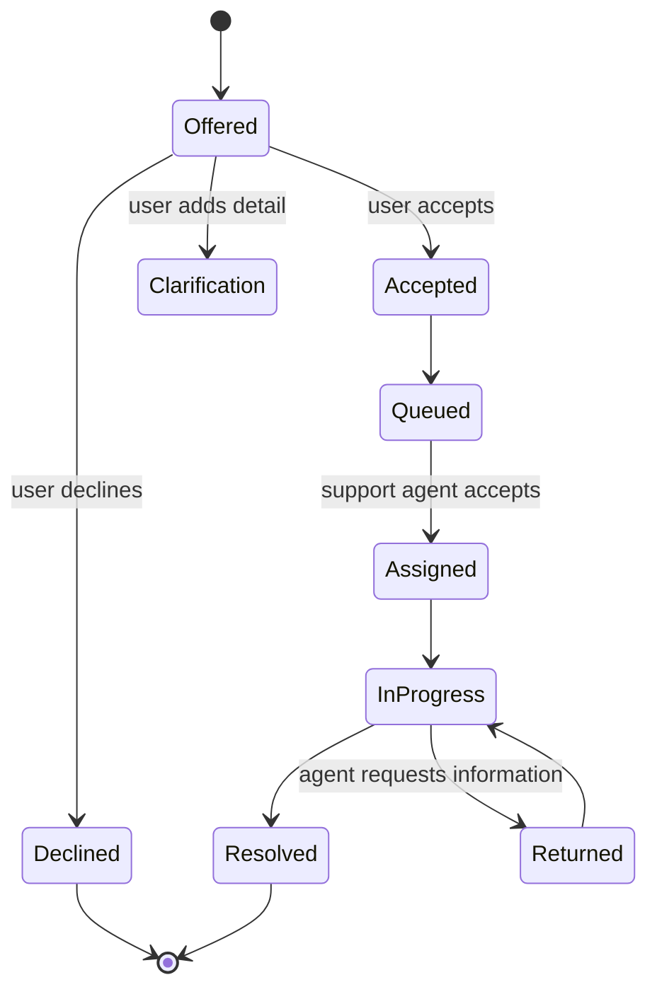

# CampusOne — Fallback and Human Handoff

## 1. Objective

Fallback is a safe product outcome, not an error disguised as an answer. CampusOne must state what it could and could not determine, preserve context, recommend an owner, and avoid exposing internal prompts or chain-of-thought.

## 2. Trigger reasons

```text
low_routing_confidence
ambiguous_top_candidates
unsupported_domain
no_evidence
stale_evidence
conflicting_knowledge
sensitive_request
explicit_human_request
repeated_failed_attempts
skill_timeout
router_unavailable
account_action_required
```

Reason codes are stable analytics dimensions. A handoff may contain more than one code, with one primary reason.

## 3. Decision table

| Condition | User response | Handoff record |
|---|---|---|
| confidence 0.45–0.74, identifiable candidates | ask one clarification | not yet; store pending clarification |
| confidence < 0.45 | explain unsupported/unclear and offer department options | create only if user accepts or policy requires |
| no relevant evidence | no-answer + owner next step | offer/create `no_evidence` handoff |
| conflicting current sources | explain inconsistency | immediate handoff to owner |
| sensitive/restricted request | refuse unsafe part | immediate restricted handoff |
| explicit human request | acknowledge and collect minimal context | immediate handoff |
| repeated failed attempts | summarise attempts | immediate handoff |
| skill timeout | preserve completed sub-answers | offer handoff with timeout reason |

## 4. Handoff state machine



For the hackathon, `Queued` may be a database-backed mock inbox. The UI must not say a real ticket was created unless an integration returns a ticket ID.

## 5. Handoff payload

```json
{
  "handoff_id": "a5e5a7f4-51a6-4e9e-9cd3-ec1ce9a4c55b",
  "conversation_id": "4b4b1f2d-42fd-4da6-8933-0b7e72cc3a55",
  "status": "queued",
  "reason_codes": ["no_evidence"],
  "recommended_department": "Finance Office",
  "candidate_domains": ["finance"],
  "summary": "Student says payment was deducted yesterday but portal still shows unpaid.",
  "recent_message_ids": ["...", "..."],
  "attempted_actions": ["Retrieved current fee payment policy"],
  "missing_information": ["transaction reference, if the student chooses to provide it"],
  "created_at": "2026-09-11T07:00:00Z"
}
```

Do not include full payment credentials, passwords, OTPs, or unrelated history. Redact PII before agent-facing output.

## 6. User-facing copy

### Clarification

```text
I can help, but “account problem” could mean a sign-in issue, a fee/payment issue, or updating your student details. Which one are you trying to fix?
```

### No evidence

```text
I could not find an approved university source for that process, so I do not want to guess. The {department} team can confirm it. Would you like me to prepare a handoff with this conversation?
```

### Handoff accepted

```text
I’ve prepared the context for the {department} team. They need to review this because {plain-language reason}. Your conversation reference is {reference}. Do not share passwords, OTPs, or full payment-card details here.
```

### Sensitive request

```text
I cannot provide or retrieve another person's private information. I can explain the official request process or connect you with the authorised office.
```

## 7. Context summarisation

Use a structured summary template, preferably generated by deterministic code and optionally compressed by a model with strict JSON output:

```json
{
  "goal": "...",
  "facts_reported_by_user": ["..."],
  "domains_attempted": ["finance", "it"],
  "answers_given": [{"domain": "finance", "claim": "...", "citation_ids": ["..."]}],
  "unresolved": ["..."],
  "safety_notes": ["..."],
  "requested_next_action": "human review"
}
```

The summary is labelled as user-reported versus system-verified. Support agents can see the source citation metadata but not hidden prompts or model reasoning.

## 8. Repeated failure policy

Increment a failed-resolution counter when a turn ends in no evidence, a skill timeout, an unanswered clarification, or explicit user dissatisfaction. Reset after a supported answer or user-marked resolution. At `HANDOFF_AFTER_FAILED_TURNS` (default 3), offer or create a handoff depending on the reason.

## 9. Agent and admin endpoints

The MVP supports:

- student creates/accepts a handoff;
- support agent lists queued handoffs for authorised departments;
- support agent claims a handoff;
- support agent marks resolved or returns for more information;
- audit log records each transition.

External ticketing is an adapter with the same state model. Its absence must not block the demo. For full endpoint schemas, see [09 API Reference](09_API_Reference.md).

## 10. Acceptance criteria

- Low confidence never invokes a random domain skill.
- No-evidence answers contain no unsupported policy claims.
- Every handoff stores reason, suggested department, summary, and recent message IDs.
- The UI displays a next action and does not imply external ticket creation without confirmation.
- Sensitive requests are redacted in logs and agent summaries.

