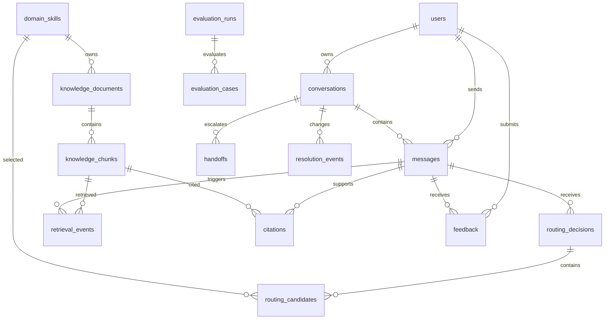

# CampusOne — Database Design

## 1. Database choice

Use PostgreSQL 16 or a managed PostgreSQL service with the `vector` extension. SQLAlchemy 2.x with Alembic owns migrations. UUIDs are generated by the application; all times are `timestamptz` in UTC. JSONB is used for versioned model metadata and flexible event payloads, not for fields that need relational constraints or analytics indexes.

## 2. Entity relationship diagram

## 3. Common conventions

- Primary keys: `uuid`.
- `created_at`, `updated_at`: `timestamptz not null default now()`.
- Soft-retirable records use `archived_at`; never delete published knowledge needed for audit.
- Enum values are represented as checked text values or PostgreSQL enums managed by migrations. Application schemas must use the same literals.
- All foreign keys that reference user content use `on delete restrict` or soft delete; do not cascade-delete audit data.

## 4. Table definitions

### `users`

| Column | Type | Rules |
|---|---|---|
| `id` | uuid | PK |
| `external_subject` | varchar(255) | not null, unique; mock ID or OIDC `sub` |
| `email_hash` | char(64) | not null; hash for analytics joins |
| `display_name` | varchar(160) | nullable, encrypted or minimised |
| `role` | varchar(32) | not null; student/staff/support_agent/knowledge_admin/analyst/admin |
| `department` | varchar(80) | nullable |
| `status` | varchar(20) | not null; active/disabled |
| `created_at` | timestamptz | not null |
| `last_seen_at` | timestamptz | nullable |

Indexes: unique `external_subject`; `(role, status)`; `email_hash` only if support lookup requires it.

### `conversations`

| Column | Type | Rules |
|---|---|---|
| `id` | uuid | PK |
| `user_id` | uuid | FK users, not null |
| `title` | varchar(160) | nullable, generated from first question |
| `status` | varchar(20) | open/closed/archived |
| `resolution_state` | varchar(32) | open/resolved/needs_clarification/handed_off/unresolved |
| `active_domain` | varchar(40) | nullable |
| `previous_domains` | jsonb | not null default `[]` |
| `unresolved_intents` | jsonb | not null default `[]` |
| `summary` | text | nullable, redacted |
| `summary_version` | integer | not null default 0 |
| `failed_resolution_attempts` | smallint | not null default 0 |
| `version` | integer | not null default 0; optimistic locking |
| `created_at` / `updated_at` | timestamptz | not null |
| `closed_at` | timestamptz | nullable |

Indexes: `(user_id, updated_at desc)`; `(resolution_state, updated_at desc)`; `active_domain`.

### `messages`

| Column | Type | Rules |
|---|---|---|
| `id` | uuid | PK |
| `conversation_id` | uuid | FK, not null |
| `user_id` | uuid | FK, nullable for assistant/system |
| `role` | varchar(16) | user/assistant/system |
| `content` | text | not null; encrypted at rest by provider |
| `outcome` | varchar(24) | nullable; answered/clarification/handoff/fallback/error |
| `sequence_no` | integer | not null; unique per conversation |
| `idempotency_key` | varchar(128) | nullable; unique per conversation for user turns |
| `token_count` | integer | nullable |
| `created_at` | timestamptz | not null |

Indexes: unique `(conversation_id, sequence_no)`; unique partial `(conversation_id, idempotency_key)`; `(conversation_id, created_at)`.

### `routing_decisions`

| Column | Type | Rules |
|---|---|---|
| `id` | uuid | PK |
| `message_id` | uuid | FK messages, unique |
| `route_mode` | varchar(16) | single/multi/clarify/fallback/handoff |
| `primary_domain` | varchar(40) | nullable |
| `topic_switched` | boolean | not null default false |
| `top_confidence` | numeric(5,4) | check 0..1 |
| `raw_scores` | jsonb | not null |
| `reason_code` | varchar(64) | not null |
| `safety_flags` | jsonb | not null default `[]` |
| `clarification_payload` | jsonb | nullable |
| `model_name` / `model_version` | varchar(120) | nullable |
| `calibration_version` | varchar(40) | nullable |
| `latency_ms` | integer | nullable |
| `created_at` | timestamptz | not null |

Indexes: `(primary_domain, created_at)`; `(route_mode, created_at)`; `(reason_code, created_at)`.

### `routing_candidates`

| Column | Type | Rules |
|---|---|---|
| `id` | uuid | PK |
| `routing_decision_id` | uuid | FK, not null |
| `domain_skill_id` | uuid | FK, not null |
| `intent` | varchar(80) | not null |
| `rank` | smallint | not null |
| `raw_score` / `confidence` | numeric(5,4) | check 0..1 |
| `signals` | jsonb | not null default `[]` |
| `depends_on_candidate_id` | uuid | nullable; self-referencing FK to `routing_candidates.id` |

Unique `(routing_decision_id, domain_skill_id, intent)` and `(routing_decision_id, rank)`.

### `domain_skills`

| Column | Type | Rules |
|---|---|---|
| `id` | uuid | PK |
| `key` | varchar(40) | unique, not null |
| `display_name` | varchar(80) | not null |
| `version` | varchar(40) | not null |
| `config` | jsonb | not null |
| `prompt_version` | varchar(40) | not null |
| `enabled` | boolean | not null default true |
| `created_at` / `updated_at` | timestamptz | not null |

### `knowledge_documents`

| Column | Type | Rules |
|---|---|---|
| `id` | uuid | PK |
| `domain_skill_id` | uuid | FK, not null |
| `title` | varchar(255) | not null |
| `document_type` | varchar(40) | policy/faq/procedure/guide/contact |
| `source_uri` | text | not null |
| `content_sha256` | char(64) | not null |
| `version_label` | varchar(80) | not null |
| `status` | varchar(20) | draft/processing/review/published/superseded/archived/failed |
| `effective_from` / `effective_until` | timestamptz | not null / nullable |
| `audience_roles` | jsonb | not null |
| `language` | varchar(12) | not null default `en` |
| `owner_department` | varchar(120) | not null |
| `ingestion_error` | text | nullable, redacted |
| `approved_by` | uuid | FK users, nullable |
| `published_at` | timestamptz | nullable |
| `created_at` / `updated_at` | timestamptz | not null |

Unique `(domain_skill_id, content_sha256, version_label)`; indexes on `(domain_skill_id, status)`, effective dates, and `source_uri`.

### `knowledge_chunks`

| Column | Type | Rules |
|---|---|---|
| `id` | uuid | PK |
| `document_id` | uuid | FK, not null |
| `chunk_index` | integer | not null |
| `content` | text | not null |
| `retrieval_text` | text | not null |
| `embedding` | vector(1536) | not null after processing |
| `embedding_model` | varchar(120) | not null |
| `token_count` | integer | not null |
| `heading_path` | jsonb | not null default `[]` |
| `page_number` | integer | nullable |
| `char_start` / `char_end` | integer | nullable |
| `metadata` | jsonb | not null default `{}` |
| `text_search_vector` | tsvector | GENERATED ALWAYS AS (to_tsvector('english', retrieval_text)) STORED |
| `created_at` | timestamptz | not null |

Unique `(document_id, chunk_index)`; HNSW index on `embedding` with cosine operator (`vector_cosine_ops`); GIN index on `text_search_vector`.

### `retrieval_events`

| Column | Type | Rules |
|---|---|---|
| `id` | uuid | PK |
| `message_id` | uuid | FK, not null |
| `domain_skill_id` | uuid | FK, not null |
| `query_hash` | char(64) | not null |
| `filters` | jsonb | not null |
| `results` | jsonb | not null; chunk IDs, scores, rank |
| `selected_chunk_ids` | jsonb | not null |
| `min_score` | numeric(5,4) | nullable |
| `has_evidence` | boolean | not null |
| `conflict_detected` | boolean | not null default false |
| `latency_ms` | integer | nullable |
| `created_at` | timestamptz | not null |

### `citations`

| Column | Type | Rules |
|---|---|---|
| `id` | uuid | PK |
| `message_id` | uuid | FK assistant message, not null |
| `chunk_id` | uuid | FK, not null |
| `domain_skill_id` | uuid | FK, not null |
| `marker` | varchar(12) | not null, e.g. `[1]` |
| `claim_text` | text | not null, short claim only |
| `excerpt` | text | not null |
| `created_at` | timestamptz | not null |

Unique `(message_id, marker)`; index `(chunk_id)`.

### `handoffs`

| Column | Type | Rules |
|---|---|---|
| `id` | uuid | PK |
| `conversation_id` | uuid | FK, not null |
| `created_by_user_id` | uuid | FK, not null |
| `assigned_to_user_id` | uuid | FK, nullable |
| `status` | varchar(20) | offered/queued/assigned/in_progress/returned/resolved/declined |
| `reason_codes` | jsonb | not null |
| `recommended_department` | varchar(120) | nullable |
| `candidate_domains` | jsonb | not null |
| `summary` | text | not null |
| `recent_message_ids` | jsonb | not null |
| `missing_information` | jsonb | not null default `[]` |
| `external_ticket_id` | varchar(120) | nullable |
| `created_at` / `updated_at` | timestamptz | not null |

### `feedback`

| Column | Type | Rules |
|---|---|---|
| `id` | uuid | PK |
| `message_id` | uuid | FK, not null |
| `user_id` | uuid | FK, not null |
| `rating` | varchar(12) | positive/negative |
| `reason` | varchar(80) | nullable |
| `comment` | text | nullable, redacted |
| `created_at` | timestamptz | not null |

Unique `(message_id, user_id)`.

### `resolution_events`

| Column | Type | Rules |
|---|---|---|
| `id` | uuid | PK |
| `conversation_id` | uuid | FK, not null |
| `message_id` | uuid | FK, nullable |
| `from_state` / `to_state` | varchar(32) | not null |
| `reason` | varchar(80) | not null |
| `actor_type` | varchar(20) | system/user/agent |
| `metadata` | jsonb | not null default `{}` |
| `created_at` | timestamptz | not null |

### `evaluation_cases`

| Column | Type | Rules |
|---|---|---|
| `id` | uuid | PK |
| `dataset_version` | varchar(40) | not null |
| `external_key` | varchar(120) | unique, not null |
| `input` | text | not null |
| `conversation_context` | jsonb | not null default `{}` |
| `expected_domains` | jsonb | not null |
| `expected_confidence_range` | numrange | nullable |
| `expected_behavior` | varchar(40) | not null |
| `expected_sources` | jsonb | not null default `[]` |
| `expected_resolution_state` | varchar(32) | not null |
| `tags` | jsonb | not null default `[]` |

### `evaluation_runs`

| Column | Type | Rules |
|---|---|---|
| `id` | uuid | PK |
| `dataset_version` | varchar(40) | not null |
| `status` | varchar(20) | queued/running/passed/failed |
| `config` | jsonb | not null |
| `metrics` | jsonb | nullable |
| `confusion_matrix` | jsonb | nullable |
| `started_at` / `completed_at` | timestamptz | nullable |
| `created_by` | uuid | FK users, not null |

The case result may be stored in `evaluation_run.metrics.case_results` for MVP; create a separate `evaluation_case_results` table if runs exceed the retention volume.

## 5. Constraints and security

- Row-level ownership checks are enforced in the service layer and may be duplicated with PostgreSQL RLS in production.
- `domain_skills.key` is immutable after publication.
- A published document must have at least one chunk and an approved publisher.
- A citation's chunk must belong to a document whose domain matches the citation domain.
- A conversation's `resolution_state=handed_off` requires at least one handoff row.
- `top_confidence`, scores, and embeddings are validated before insert.

## 6. Retention

Default prototype policy: retain conversations and messages for 90 days, audit/routing aggregates for 365 days, published knowledge and handoff audit history for the life of the deployment, and raw evaluation text indefinitely only in a development environment. Production retention must follow university policy. A nightly redaction job anonymises or deletes expired message content while preserving metric dimensions.

## 7. Migration order

1. extensions and enums;
2. users and domain skills;
3. conversations and messages;
4. routing decisions/candidates;
5. documents/chunks and vector/full-text indexes;
6. retrieval/citations;
7. handoffs/feedback/resolution;
8. evaluation tables;
9. seed domains and demo user.

