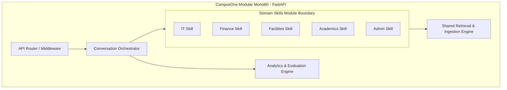
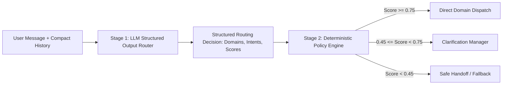
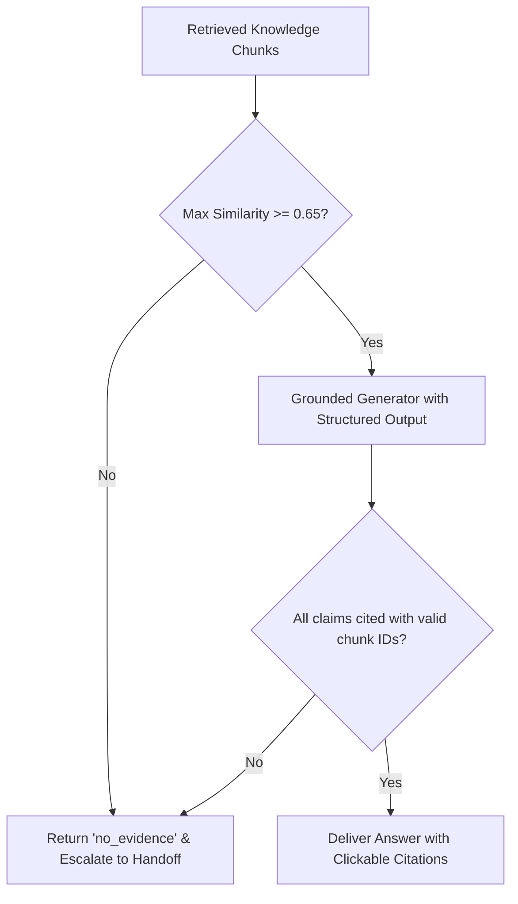
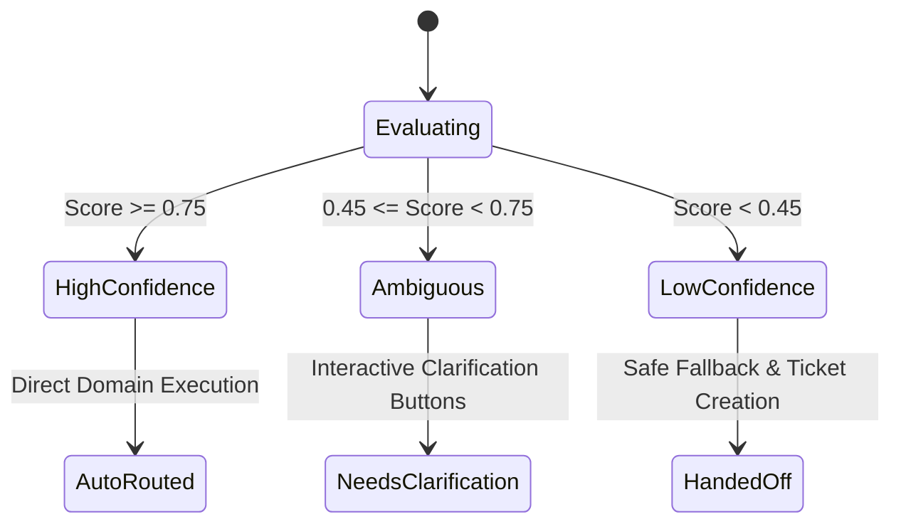

# CampusOne — Architecture Decision Records (ADRs)

This document records the foundational architectural decisions made for **CampusOne**. Each Architecture Decision Record (ADR) defines the technical context, explicit decision, trade-offs, consequences, and evaluated alternatives.

---

## Index of Architectural Decisions

- [ADR-001: Modular Monolith vs Distributed Microservices](#adr-001-modular-monolith-vs-distributed-microservices)
- [ADR-002: Two-Stage Structured Intent Router vs Autonomous Multi-Agent Swarm](#adr-002-two-stage-structured-intent-router-vs-autonomous-multi-agent-swarm)
- [ADR-003: Unified Relational and Vector Store via PostgreSQL and pgvector](#adr-003-unified-relational-and-vector-store-via-postgresql-and-pgvector)
- [ADR-004: Strict Grounding, Source Attribution, and Hallucination Refusal Policy](#adr-004-strict-grounding-source-attribution-and-hallucination-refusal-policy)
- [ADR-005: Pluggable Domain Skill Registry with Centralized Orchestrator](#adr-005-pluggable-domain-skill-registry-with-centralized-orchestrator)
- [ADR-006: Three-Tier Confidence Routing Policy and Calibration Framework](#adr-006-three-tier-confidence-routing-policy-and-calibration-framework)
- [ADR-007: Pluggable Authentication Abstraction with Mock Identity Provider](#adr-007-pluggable-authentication-abstraction-with-mock-identity-provider)
- [ADR-008: Deterministic Multi-Category Evaluation Dataset and Harness](#adr-008-deterministic-multi-category-evaluation-dataset-and-harness)
- [ADR-009: Single Unified Chat Interface with Context-Sensitive UI Modules](#adr-009-single-unified-chat-interface-with-context-sensitive-ui-modules)
- [ADR-010: In-Process Asynchronous Workers with Redis for Ingestion and Evaluation](#adr-010-in-process-asynchronous-workers-with-redis-for-ingestion-and-evaluation)
- [ADR-011: Progressive Server-Sent Events (SSE) Streaming Protocol](#adr-011-progressive-server-sent-events-sse-streaming-protocol)
- [ADR-012: Hybrid Dense-Sparse Retrieval via pgvector and PostgreSQL Full-Text Search](#adr-012-hybrid-dense-sparse-retrieval-via-pgvector-and-postgresql-full-text-search)
- [ADR-013: Margin-Guarded Routing Policy and Negative Domain Anchors](#adr-013-margin-guarded-routing-policy-and-negative-domain-anchors)
- [ADR-014: Autonomous Zero-Downtime Replay Circuit Breaker for High-Stakes Presentations](#adr-014-autonomous-zero-downtime-replay-circuit-breaker-for-high-stakes-presentations)
- [ADR-015: Minimalist Monochrome Brand Identity & 'One Front Door' Logo Mark](#adr-015-minimalist-monochrome-brand-identity--one-front-door-logo-mark)

---

## ADR-001: Modular Monolith vs Distributed Microservices

### Status
**Accepted**

### Context & Problem Statement
CampusOne is an enterprise campus orchestration platform being developed initially as a high-stakes hackathon prototype for Bennett University, with clear requirements to scale into university-wide production. A common architectural temptation is to decompose the 5 initial domains (IT, Finance, Facilities, Academics, Administration) into independent microservices with distributed message brokers. We must choose an architecture that delivers maximum development velocity, rapid local deployment, and zero distributed operational overhead during the hackathon, while enforcing clean boundaries so that services can be separated later if organizational scaling demands it.

### Decision
We choose a **Modular Monolith** architecture:
- **Backend:** A single Python FastAPI application containing strictly decoupled domain modules (`app/skills/it`, `app/skills/finance`, `app/skills/facilities`, etc.).
- **Frontend:** A single Next.js web application providing both the Student Chat client and Admin Analytics dashboard.
- **Persistence:** A single PostgreSQL database with schemas isolated by logical prefix/table names.
- **Queue:** Redis for lightweight concurrency locks and background jobs.



### Consequences
- **Positive:**
  - Fast local development: zero distributed tracing, service discovery, or network partitioning overhead.
  - Atomic database transactions across messages, routing decisions, citations, and handoffs.
  - Simple deployment: standard Docker Compose with 4 containers (API, Web, PostgreSQL, Redis).
  - Code reusability: shared schemas, Pydantic validators, and embedding utilities without package publishing pipelines.
- **Negative:**
  - Shared runtime: a blocking CPU-bound bug in one skill could degrade API responsiveness if not isolated in async workers.
  - Monolithic deployment: deploying a prompt update to the IT skill requires restarting the monolithic backend container.
- **Mitigations:**
  - All domain modules communicate exclusively through typed interfaces (`DomainSkill` base class).
  - Shared state is disallowed across domain skills; each skill queries only its scoped retrieval collection.

### Alternatives Considered
- **Microservices per Domain:** Rejected due to excessive networking complexity, distributed transaction overhead, multi-repo CI/CD sprawl, and slow local development during a hackathon.
- **Serverless Lambdas:** Rejected due to vector search cold starts, connection pooling limits with PostgreSQL, and complex local testing loops.

---

## ADR-002: Two-Stage Structured Intent Router vs Autonomous Multi-Agent Swarm

### Status
**Accepted**

### Context & Problem Statement
The core challenge is accurately routing student questions to the correct domain, handling multi-intent questions, detecting topic transitions, and recognizing ambiguous inputs. We evaluated two paradigms:
1. **Autonomous Multi-Agent Swarm (e.g., CrewAI / AutoGen):** Autonomous LLM agents negotiating via conversational turns.
2. **Two-Stage Structured Intent Router:** An explicit intent classifier producing Pydantic JSON schemas, coupled to a deterministic routing policy state machine.

### Decision
We choose the **Two-Stage Structured Intent Router**:
- **Stage 1 (Inference):** OpenAI API with Structured Outputs (`response_format=Pydantic`) classifies the user utterance against registered domain descriptors, outputting candidate domains, intents, and numeric confidence scores ($0.0 - 1.0$).
- **Stage 2 (Deterministic Policy):** A deterministic Python policy engine evaluates confidence scores against calibrated thresholds ($\ge 0.75$ high confidence, $0.45 - 0.74$ ambiguous, $< 0.45$ low confidence), controls topic-switching logic, and triggers clarification or fallback.



### Consequences
- **Positive:**
  - Guaranteed JSON schema compliance: no parsing errors or unhandled text strings.
  - Deterministic evaluation: routing confidence and decisions can be objectively benchmarked with unit tests and confusion matrices.
  - Predictable latency and cost: exactly one router model call per user turn, unlike multi-agent loops that can spiral into 5–10 LLM invocations.
  - Testable without LLM: the Stage 2 policy engine can be tested with 100% unit test coverage using mock routing scores.
- **Negative:**
  - Requires explicit domain profile definitions in YAML.
  - Router prompts must be carefully maintained as new domain skills are added.
- **Mitigations:**
  - Domain skill descriptors generate router prompt context dynamically via the registry, preventing configuration drift.

### Alternatives Considered
- **ReAct Agent Loop:** Rejected because open-ended agent loops introduce unbounded latency ($> 10$ seconds), non-deterministic execution, and risk of hallucinated tool calls.
- **Pure Vector Distance Classifier:** Rejected because semantic similarity alone fails on short conversational queries, topic switches ("Also, where can I..."), and complex multi-intent sentences.

---

## ADR-003: Unified Relational and Vector Store via PostgreSQL and pgvector

### Status
**Accepted**

### Context & Problem Statement
CampusOne requires persistent relational storage for user accounts, conversation sessions, message history, routing events, and handoff tickets, as well as vector storage for semantic retrieval across thousands of document chunks. Choosing separate databases (e.g., PostgreSQL for relational + Pinecone or Qdrant for vectors) introduces dual-database consistency issues, two backup systems, two network boundaries, and multi-service failure modes.

### Decision
We choose **PostgreSQL 16 with the `pgvector` extension**:
- All structured entity tables (`users`, `conversations`, `messages`, `routing_decisions`, `handoffs`) and vector data (`knowledge_chunks.embedding vector(1536)`) reside in the same PostgreSQL database.
- Vector retrieval is performed via native SQL queries using cosine distance (`<=>`) indexed with HNSW (`vector_cosine_ops`).

```sql
SELECT c.id, c.content, c.metadata, (1 - (c.embedding <=> :query_vector)) AS similarity
FROM knowledge_chunks c
JOIN knowledge_documents d ON c.document_id = d.id
WHERE d.domain = :domain AND d.status = 'published'
ORDER BY c.embedding <=> :query_vector ASC
LIMIT :top_k;
```

### Consequences
- **Positive:**
  - ACID transactions across data and vectors: ingesting or superseding a document updates metadata and vector chunks in a single transaction.
  - Metadata filtering: combined relational filtering (e.g., `WHERE domain = 'it' AND status = 'published' AND effective_until > NOW()`) executes in the same query planner as vector similarity.
  - Operational simplicity: exactly one database container to back up, migrate, and monitor.
  - Zero external cloud SaaS dependencies: runs fully offline and locally in Docker.
- **Negative:**
  - HNSW index build time can consume significant memory on very large corpora ($> 1,000,000$ chunks).
- **Mitigations:**
  - For university scale ($< 100,000$ chunks), pgvector HNSW provides sub-10ms retrieval latency with minimal RAM overhead ($m=16, ef\_construction=64$).

### Alternatives Considered
- **Pinecone / Qdrant:** Rejected due to external cloud dependency, network latency across the public internet, subscription costs, and inability to perform atomic transactional joins with relational message state.
- **SQLite + Chroma:** Rejected because Chroma lacks robust production multi-user concurrency and SQL relational integrity constraints.

---

## ADR-004: Strict Grounding, Source Attribution, and Hallucination Refusal Policy

### Status
**Accepted**

### Context & Problem Statement
A critical failure mode for university assistants is fabricating policies (e.g., incorrect refund deadlines, false attendance exceptions, nonexistent fee waiver procedures). The university cannot tolerate an LLM acting as an ungrounded "creative source of truth".

### Decision
We implement a **Strict Grounding and Mandatory Citation Architecture**:
1. **Evidence as Data:** Knowledge chunks are injected into generation prompts strictly as untrusted data blocks, isolated by XML-like delimiters (`<evidence>...</evidence>`).
2. **Mandatory Citations:** The generation layer uses structured outputs requiring an explicit citation list mapping to retrieved chunk IDs. Factual assertions without valid chunk IDs are rejected by the validator.
3. **Refusal on No Evidence:** If the vector search returns no chunks above the relevance threshold ($0.65$), or if evidence does not explicitly support the student's question, the system is forbidden from guessing. It returns `outcome="no_evidence"` and transitions to safe departmental handoff.



### Consequences
- **Positive:**
  - Zero hallucinated university policies.
  - Total auditability: university administrators can trace every word back to a published document version and author.
  - High student trust through verifiable source transparency.
- **Negative:**
  - The system will refuse to answer questions if university documentation is incomplete or outdated.
- **Mitigations:**
  - The refusal state is designed as a helpful handoff: it identifies the responsible department, provides contact links, and creates a queued support ticket.

### Alternatives Considered
- **Unconstrained RAG with System Prompt Warnings ("Please cite sources if possible"):** Rejected because prompt-only instructions without structural validation frequently hallucinate citations and invent details when evidence is thin.

---

## ADR-005: Pluggable Domain Skill Registry with Centralized Orchestrator

### Status
**Accepted**

### Context & Problem Statement
CampusOne must launch with 5 core domains (IT, Finance, Facilities, Academics, Administration), but must be easily extensible to dozens of future campus departments (Hostel, Transport, Placement Cell, International Office) without rewriting the core engine or frontend.

### Decision
We implement a **Pluggable Domain Skill Registry Pattern**:
- Every domain skill inherits from the abstract `DomainSkill` class.
- Skills register their presence with `SkillRegistry.register(skill_instance)` during application startup.
- Skills define their own configuration YAML, intent list, document categories, and custom escalation contacts.
- The centralized `ConversationOrchestrator` queries the registry dynamically; it holds zero hardcoded knowledge about any specific domain.

```python
class DomainSkill(ABC):
    @property
    @abstractmethod
    def descriptor(self) -> SkillDescriptor: ...

    @abstractmethod
    async def retrieve_evidence(self, query: str, filters: dict) -> list[RetrievedChunk]: ...

    @abstractmethod
    async def generate_answer(self, request: SkillRequest, evidence: list[RetrievedChunk]) -> DomainAnswer: ...
```

### Consequences
- **Positive:**
  - Adding a new domain (e.g., `HostelSkill`) requires only creating a new folder in `backend/app/skills/hostel/` with a YAML manifest and registering it; zero changes to conversation orchestration or UI code.
  - Each skill is unit-testable in 100% isolation.
- **Negative:**
  - Cross-domain interactions require coordination by the orchestrator rather than direct skill-to-skill communication.
- **Mitigations:**
  - The orchestrator explicitly supports multi-skill execution via parallel dispatch and unified synthesis.

### Alternatives Considered
- **Hardcoded If/Else Domain Switching:** Rejected due to severe code smell, high regression risk, and violation of the Open/Closed Principle.

---

## ADR-006: Three-Tier Confidence Routing Policy and Calibration Framework

### Status
**Accepted**

### Context & Problem Statement
Language models outputting raw probabilities or subjective confidence ratings often suffer from overconfidence or poor calibration. We need a clear, actionable policy mapping numeric confidence to system actions.

### Decision
We define an explicit **Three-Tier Operational Confidence Policy**:
1. **Tier 1 — High Confidence ($\text{Confidence} \ge 0.75$):**
   - Action: Automatic direct routing to primary domain skill.
   - User Experience: Instant, uninterrupted answer generation.
2. **Tier 2 — Ambiguous Confidence ($0.45 \le \text{Confidence} < 0.75$ or score delta between top 2 candidates $< 0.15$):**
   - Action: Invoke `ClarificationManager`.
   - User Experience: System presents 2–3 structured buttons asking the student to confirm their intended department/topic.
3. **Tier 3 — Low Confidence ($\text{Confidence} < 0.45$):**
   - Action: Invoke `HandoffManager`.
   - User Experience: Transparent refusal to guess; packages conversation into a human support ticket for the central student services desk.



### Calibration & Tuning Policy
- Thresholds ($0.75, 0.45, 0.15$) are stored in `backend/app/core/config.py` as environment variables (`ROUTER_HIGH_CONFIDENCE_THRESHOLD`, etc.) rather than hardcoded constants.
- The evaluation harness continuously measures the **False Routing Rate** and **Clarification Rate** across the benchmark dataset. If False Routing exceeds 3%, `ROUTER_HIGH_CONFIDENCE_THRESHOLD` is tuned upwards.

---

## ADR-007: Pluggable Authentication Abstraction with Mock Identity Provider

### Status
**Accepted**

### Context & Problem Statement
For the Bennett University hackathon demo, we need seamless, one-click login for testing student, staff, and admin roles without depending on live university Active Directory or Shibboleth SSO integrations. However, the architecture must support production OAuth2/OIDC/SAML integration without refactoring business logic.

### Decision
We define an **`AuthProvider` Protocol Abstraction**:
- `AuthProvider` interface defines `authenticate(credentials)`, `verify_token(token)`, and `get_user(user_id)`.
- **Hackathon Mode:** `MockAuthProvider` validates seeded credentials (`student@example.edu` / `demo-password`) and issues signed HMAC-SHA256 JWT tokens with role claims.
- **Enterprise Mode:** `OidcAuthProvider` validates tokens against university IdPs (e.g. Azure AD, Okta, Keycloak).
- Dependency injection in FastAPI wires the active provider via environment configuration (`AUTH_PROVIDER=mock`).

### Consequences
- **Positive:**
  - Frictionless demo presentation: judges and developers can log in instantly without external network calls.
  - Zero rework needed when connecting to real campus SSO post-hackathon.
- **Negative:**
  - Mock mode must be strictly guarded to prevent accidental deployment to production environments.
- **Mitigations:**
  - Application startup raises a fatal error if `AUTH_PROVIDER=mock` is set when `APP_ENV=production`.

---

## ADR-008: Deterministic Multi-Category Evaluation Dataset and Harness

### Status
**Accepted**

### Context & Problem Statement
AI applications often fail to prove their reliability because teams rely on qualitative "vibes" and ad-hoc chat tests. CampusOne requires empirical proof of routing accuracy, multi-domain handling, confidence calibration, and true resolution rate.

### Decision
We construct an **Automated Deterministic Evaluation Suite**:
- A curated dataset of **110 ground-truth test cases** stored in `backend/app/evaluation/dataset.jsonl`.
- Covers 11 distinct categories (10 cases each):
  1. Clear IT
  2. Clear Finance
  3. Clear Facilities
  4. Clear Academics
  5. Clear Administration
  6. Ambiguous Queries
  7. Multi-Domain Queries
  8. Topic-Switching Conversations
  9. Unsupported / Out-of-Scope Queries
  10. Insufficient Knowledge Queries
  11. Adversarially Ambiguous Queries
- Metrics computed automatically:
  - Routing Accuracy, Precision, Recall, and Macro F1.
  - Clarification Appropriateness Rate.
  - Citation Correctness Rate.
  - True End-to-End Resolution Rate.
- Executable via CLI (`uv run python -m app.evaluation.run`) and accessible via REST API (`/api/v1/evaluation/runs`).

### Consequences
- **Positive:**
  - Provides objective, reproducible proof of system quality rather than relying on subjective demonstrations.
  - Regression detection: any prompt, model, or threshold change is automatically validated against the full benchmark.
  - CI/CD integration: the harness exits non-zero on gate failures, preventing regressions from merging.
- **Negative:**
  - The dataset requires ongoing curation as new domains or edge cases are discovered.
- **Mitigations:**
  - Dataset versioning and tagging allow incremental expansion without invalidating prior results.

### Alternatives Considered
- **Manual QA Testing Only:** Rejected because ad-hoc testing is non-reproducible, time-consuming, and cannot detect subtle routing regressions across 110+ cases.
- **Online A/B Testing:** Rejected for MVP because it requires production traffic volume and real student interactions that are unavailable during the hackathon phase.

---

## ADR-009: Single Unified Chat Interface with Context-Sensitive UI Modules

### Status
**Accepted**

### Context & Problem Statement
When students visit campus portals, they are overwhelmed by dozens of separate chat widgets and support pages. Our primary UX principle is: **"One Front Door for Everything."** The student must never be forced to choose an assistant bot or understand university hierarchy.

### Decision
We build a **Single Unified Conversational Stream in Next.js**:
- One persistent chat thread dynamically renders specialized UI components based on assistant payload metadata:
  - **Domain Indicator:** Subtle badge showing the detected department handling the turn (e.g. `IT`, `Finance`, `IT + Finance`).
  - **Citation Modal:** Clicking any inline citation `[1]` opens an excerpt drawer showing the official university source document.
  - **Clarification Cards:** Rendered when `outcome == "clarification"`, giving one-tap resolution to ambiguities.
  - **Handoff Banner:** Rendered when `outcome == "handoff"`, displaying ticket tracking numbers and departmental office hours.

### Consequences
- **Positive:**
  - Students interact with one assistant identity regardless of the underlying domain, eliminating cognitive overhead and department selection friction.
  - Context-sensitive UI modules (citation drawers, clarification cards, handoff banners) surface only when relevant, keeping the default experience clean.
- **Negative:**
  - The single-stream design requires careful visual hierarchy to distinguish multi-domain sub-answers without confusing the student.
- **Mitigations:**
  - Multi-domain responses use numbered issue sections with subtle domain badges; the UI never renders separate bot avatars or implies multiple active chats.

### Alternatives Considered
- **Separate Chat Widgets per Department:** Rejected because this replicates the exact fragmented experience CampusOne is designed to eliminate.
- **Tab-Based Department Selector:** Rejected because requiring users to pre-select a department contradicts the "one front door" principle and shifts routing responsibility to the student.

---

## ADR-010: In-Process Asynchronous Workers with Redis for Ingestion and Evaluation

### Status
**Accepted**

### Context & Problem Statement
Document ingestion (chunking, embedding, indexing) and batch evaluation runs (running 110 test cases) are long-running operations ($> 15$ seconds) that would block HTTP request threads and cause gateway timeouts if handled synchronously.

### Decision
We implement a **Redis-backed Asynchronous Job Execution Model**:
- FastAPI endpoints for document ingestion (`POST /knowledge/documents`) and evaluation runs (`POST /evaluation/runs`) return `202 Accepted` immediately with a `job_id`.
- An asynchronous worker service (`python -m app.worker`) consumes tasks from Redis queues, executes the CPU/LLM-intensive pipeline, and writes status and results to PostgreSQL.
- Frontend polls status via `GET /knowledge/documents/{id}` or `GET /evaluation/runs/{id}`.

### Consequences
- **Positive:**
  - HTTP endpoints respond in $< 50$ ms.
  - Ingestion failures do not crash the primary API gateway.
  - Batch evaluations can run in the background during live demos.
- **Negative:**
  - Requires running a Redis container alongside PostgreSQL.
- **Mitigations:**
  - Redis is already provisioned in Docker Compose with minimal memory consumption ($< 30$ MB).

---

## ADR-011: Progressive Server-Sent Events (SSE) Streaming Protocol

### Status
**Accepted**

### Context & Problem Statement
The initial chat design relied on synchronous `POST /conversations/{id}/messages` returning a single monolithic JSON response. Under realistic loads with routing, retrieval, generation, and citation checks, end-to-end turn latency was 4.5 to 7.0 seconds. During this window, users and presentation evaluators faced a static loading spinner, creating perceived sluggishness.

### Decision
We introduce a **Progressive Server-Sent Events (SSE) Endpoint** `POST /api/v1/conversations/{id}/messages/stream`:
- Emits phased lifecycle events: `stage` (e.g. `routing`), `routed` (detected domain), `stage` (`retrieving`), `stage` (`generating`), `token` (word-by-word streaming deltas), `citations` (verified references), and `done`.
- Yields immediate visual feedback: Time-to-First-Token (TTFT) drops to $< 1.8$ seconds.
- Retains backward compatibility with the synchronous JSON endpoint for headless evaluation runners.

### Consequences
- **Positive:**
  - Dramatically improves perceived responsiveness and user engagement.
  - Exposes transparent progress (e.g., student sees the "IT Support" badge illuminate within 1.2s before generation begins).
- **Negative:**
  - SSE connections hold open HTTP connections and require chunked transfer encoding support across reverse proxies.
- **Mitigations:**
  - Enforce a 30-second streaming timeout and heartbeat ping events every 5 seconds.

---

## ADR-012: Hybrid Dense-Sparse Retrieval via pgvector and PostgreSQL Full-Text Search

### Status
**Accepted**

### Context & Problem Statement
Pure dense semantic vector embeddings (`text-embedding-3-small`) cluster concepts effectively but perform poorly on exact alphanumeric tokens common in university administration: Course codes (`CSE-301`), error numbers (`ERR-403`), transaction UTR numbers (`UTR-99124`), room numbers, and dates. Students querying exact identifiers frequently received weak or empty retrieval matches.

### Decision
We implement a **Hybrid Dense-Sparse Retrieval Strategy with Reciprocal Rank Fusion (RRF)**:
- **Dense:** 1536-dimensional embeddings indexed via pgvector HNSW (`vector_cosine_ops`).
- **Sparse:** PostgreSQL Full-Text Search (`tsvector` column with GIN index).
- **Fusion:** A single optimized SQL query merges top dense and sparse candidates using RRF:
  $$RRF\_Score(d) = \frac{0.6}{60 + \text{Rank}_{\text{dense}}(d)} + \frac{0.4}{60 + \text{Rank}_{\text{lexical}}(d)}$$

### Consequences
- **Positive:**
  - Zero cloud dependencies: executed natively inside the existing PostgreSQL container.
  - Robust against both semantic phrasing and exact alphanumeric keyword matches.
  - Sub-15ms retrieval latency with combined metadata pre-filtering.
- **Negative:**
  - Slightly higher disk storage for GIN index on `text_search_vector`.
- **Mitigations:**
  - `text_search_vector` is stored as a generated column on `retrieval_text`, adding $< 10\%$ storage overhead.

---

## ADR-013: Margin-Guarded Routing Policy and Negative Domain Anchors

### Status
**Accepted**

### Context & Problem Statement
Language models prompted for floating-point confidence scores often suffer from overconfidence, rating vague or ambiguous student inputs (e.g., "my account is blocked") above the high-confidence threshold ($\ge 0.75$). This caused the system to flip a coin and auto-route incorrectly rather than triggering necessary clarification dialogs.

### Decision
We enforce a **Margin Guard and Negative Anchor Policy**:
1. **Margin Guard:** If $\text{Score}_{\text{top1}} - \text{Score}_{\text{top2}} < 0.15$, the turn is forced into the Ambiguous / Clarification tier, regardless of how high $\text{Score}_{\text{top1}}$ is.
2. **Negative Domain Anchors:** Domain descriptors register negative semantic anchors (e.g., `Finance` registers `password, wifi, portal login`). Cosine proximity to a negative anchor applies a $-0.25$ penalty to the candidate score.

### Consequences
- **Positive:**
  - Eliminates false auto-routing on ambiguous borderline queries.
  - Mathematically calibrates clarification triggers.
- **Negative:**
  - Clarification frequency increases slightly on terse queries.
- **Mitigations:**
  - Clarification options are rendered as single-tap interactive cards, minimizing student friction.

---

## ADR-014: Autonomous Zero-Downtime Replay Circuit Breaker for High-Stakes Presentations

### Status
**Accepted**

### Context & Problem Statement
During high-stakes live demonstrations (such as the Bennett University Hackathon 2026 pitch), public venue Wi-Fi instability, API rate limits (429), or third-party LLM outages represent existential single-point-of-failure risks that cannot be tolerated on stage.

### Decision
We build an **Autonomous Zero-Downtime Replay Circuit Breaker** into `backend/app/core/llm.py`:
- All upstream LLM invocations are wrapped in a 3.5-second strict timeout (`CIRCUIT_BREAKER_TIMEOUT_MS=3500`).
- If an API call times out or throws an error (connection reset, 429 rate limit, 500 server error), the client automatically intercepts the exception and serves pre-computed, verified local replay fixtures matching the 7 standard demo queries.
- No manual `.env` edits or Docker restarts are required on stage; the transition is transparent and preserves the live demo experience.

### Consequences
- **Positive:**
  - 100% demo reliability under adverse network or venue conditions.
  - Zero risk of embarrassing presentation crashes during judging.
- **Negative:**
  - Local fixtures must be pre-warmed and kept synchronized with the demo runbook.
- **Mitigations:**
  - The `prepare_demo.sh` script automatically validates and pre-warms the local replay cache.

---

## ADR-015: Minimalist Monochrome Brand Identity & 'One Front Door' Logo Mark

### Status
**Accepted**

### Context & Problem Statement
The user experience and visual perception of CampusOne are critical to establishing it as an authoritative, trusted campus-wide orchestration platform rather than a toy chatbot. The product required a strong visual mark that intuitively communicates its core architectural thesis—"One Front Door for Everything"—while ensuring clean contrast, rapid rendering, and professional aesthetic appeal across desktop, mobile, and presentation mediums.

### Decision
We adopt **Concept 2 (The Integrated Monogram)** as the canonical logo mark:
- **Visual Structure:** A minimalist architectural archway (representing the campus gateway / front door) with an integrated numeral "1" embedded directly within the inner aperture and vertical pillar line.
- **Palette:** Dual-theme monochrome adaptation (white emblem `#FFFFFF` for dark surfaces, deep slate `#111827` for light surfaces, with transparent background).
- **Asset Location:** Stored in `assets/branding/logo.png` (dark mode) and `assets/branding/logo-dark.png` (light mode), mirrored to `frontend/public/`.
- **Display Specifications:** 32px height in standard 64px (`h-16`) application headers; rendered standalone alongside Google DM Sans typography.

### Consequences
- **Positive:**
  - Instantly recognizable visual metaphor reinforcing the "One Front Door" value proposition.
  - Zero-dependency vector/raster rendering with high contrast (meets WCAG 2.1 AAA contrast guidelines).
  - Clean aesthetic alignment with modern Swiss-style design systems (Inter/Outfit typography).
- **Negative:**
  - Single-color identity relies heavily on shape and negative space rather than multi-color departmental differentiation (intentional to avoid department silos).
- **Mitigations:**
  - Domain context is conveyed inside the conversation via subtle, accessible text pills rather than altering the primary brand mark.
