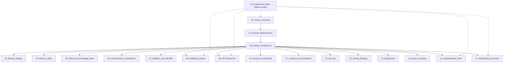
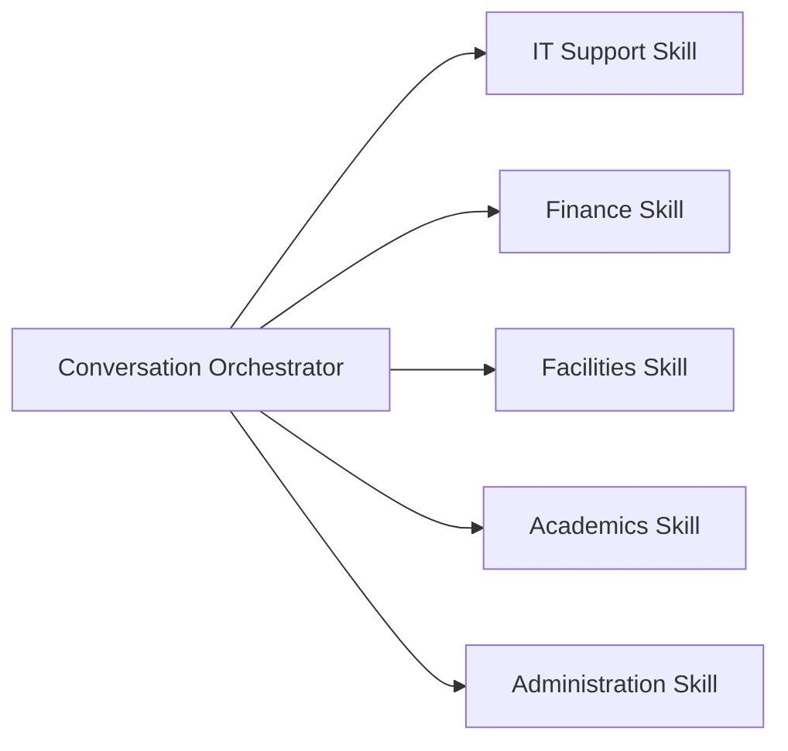
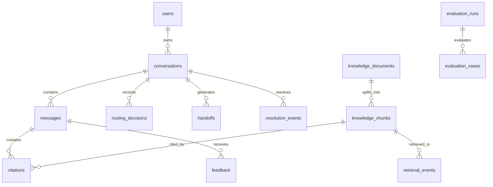

# CampusOne — Engineering Bible

## 1. Master Executive System Summary & Mission

**CampusOne** is an enterprise-grade university orchestration platform and conversational single front door. Its mission is captured in a single design principle:

> **"The user should never need to understand the university's internal organizational structure in order to get help. Ask once. Get routed right. Get it resolved."**

Universities are notoriously fragmented into bureaucratic silos: IT Helpdesks, Student Accounts/Finance, Campus Facilities, Academic Registrars, and Administrative Directorates. CampusOne replaces disjointed chatbots, confusing portal links, and bouncing email threads with a single conversational entry point. 

CampusOne is **not** an ungrounded general-purpose chatbot. It is an intelligent orchestration layer combining:
1. Two-stage structured intent routing with calibrated confidence scoring.
2. Context-aware topic switching and multi-intent synthesis.
3. Isolated, pluggable domain skills backed by pgvector semantic retrieval.
4. Strict grounding with mandatory, clickable source citations (zero hallucinations).
5. Confidence-based clarification when user intent is ambiguous ($0.45 \le \text{confidence} < 0.75$).
6. Safe departmental handoff when knowledge is absent ($< 0.45$ or zero vector evidence).
7. Empirical observability tracking true end-to-end resolution rate and routing accuracy.

---

## 2. The 12 System Invariants (Non-Negotiables)

Every component, interface, and developer contributing to CampusOne must adhere to these 12 architectural invariants without exception:

| # | Invariant | Enforcement Mechanism |
|---|---|---|
| **INV-01** | **The LLM is Never the Source of Truth:** University policies, deadlines, SLAs, and fees must come from verified retrieved knowledge chunks. | Grounded response validator rejects ungrounded claims; unit tests verify refusal on empty retrieval. |
| **INV-02** | **Mandatory Citations for University Facts:** Every factual claim must carry an inline citation marker `[N]` referencing an approved chunk ID. | `CitationManager` cross-checks cited chunk IDs against retrieved chunk database records before delivering response. |
| **INV-03** | **No Blind Guessing on Ambiguous Queries:** The system must never guess between domains when confidence is in the ambiguous tier ($0.45 \le \text{score} < 0.75$). | `RoutingPolicy` forces `outcome = "clarification"` and returns interactive clarification options. |
| **INV-04** | **Safe Fallback over Fabricated Answers:** If vector similarity fails to exceed the relevance threshold ($0.65$), the system must refuse to answer and escalate to human handoff. | Generator outputs `outcome = "no_evidence"`; `HandoffManager` creates a queued support ticket. |
| **INV-05** | **No Hidden Chain-of-Thought Exposed:** Internal reasoning, system prompts, raw vector scores, and hidden tokens are never exposed to the client or saved in user-visible logs. | Output sanitization middleware filters internal metadata; structured errors return clean reason enums. |
| **INV-06** | **Strict Domain Isolation:** Domain skills cannot query or mutate another domain's knowledge base directly. | Skills query pgvector using mandatory `domain = :domain` SQL predicates; cross-domain queries must be orchestrated by the central coordinator. |
| **INV-07** | **Idempotent Turn Execution:** Message submissions must support idempotency keys to prevent duplicate billing, state corruption, or double turns on network retries. | `Idempotency-Key` header verified against Redis/PostgreSQL within an atomic transaction. |
| **INV-08** | **Zero Secrets in Frontend or Logs:** API keys, database credentials, JWT secrets, and raw student PII must never appear in client bundles, URLs, or analytics telemetry. | PII redactor scrubs message strings before writing to analytics tables; environment variable validator asserts backend-only secret loading. |
| **INV-09** | **Continuous Context Awareness:** The router must preserve conversational continuity while allowing instantaneous topic switching without session restart. | Router receives compact conversation state (`active_domain`, `recent_intents`); topic switch updates state cleanly. |
| **INV-10** | **Empirical Verification via Deterministic Benchmarks:** System accuracy is not measured by subjective perception, but by continuous evaluation against the 110-case benchmark dataset. | CI/CD pipeline runs `run_eval.py`; PRs that degrade routing accuracy below 85% or resolution below 70% are blocked. |
| **INV-11** | **Distributed Turn Mutex Concurrency:** Concurrent client turns on the same conversation must be serialized to prevent state race conditions. | Redis `lock:conversation:{id}` with 15s TTL; optimistic concurrency check on `conversations.version`. |
| **INV-12** | **Sub-Second Streaming Feedback:** User turns must stream progressive status events and tokens rather than blocking on monolithic JSON responses. | SSE endpoint `POST /messages/stream` delivers domain detection in $< 1.2$s and TTFT in $< 1.8$s. |

---

## 3. Documentation Cross-Reference Map

The CampusOne documentation suite is modular, comprehensive, and mutually reinforcing. All documents connect through strict interface and schema contracts:



### Document Quick-Reference Index

| Document | Primary Focus | Key Contract / Artifact Defined |
|---|---|---|
| [`00_Project_Overview.md`](file:///home/armaan/Documents/Projects/msInnovateHack/docs/00_Project_Overview.md) | Vision & Scope | Problem statement, primary goals, non-goals, success criteria. |
| [`01_Product_Requirements.md`](file:///home/armaan/Documents/Projects/msInnovateHack/docs/01_Product_Requirements.md) | PRD & Features | Functional requirements (FR-AUTH, FR-CONV, FR-ROUTE, FR-RAG, FR-MULTI, FR-HAND, FR-AN, FR-KB), Non-functional SLAs. |
| [`02_System_Architecture.md`](file:///home/armaan/Documents/Projects/msInnovateHack/docs/02_System_Architecture.md) | System Boundaries | Modular monolith container boundaries, module ownership matrix. |
| [`03_Routing_Engine.md`](file:///home/armaan/Documents/Projects/msInnovateHack/docs/03_Routing_Engine.md) | Intent Routing | `RoutingDecision` schema, confidence tiers, classification pipeline. |
| [`04_Domain_Skills.md`](file:///home/armaan/Documents/Projects/msInnovateHack/docs/04_Domain_Skills.md) | Skill Handlers | `DomainSkill` interface, `SkillDescriptor`, domain contracts. |
| [`05_RAG_and_Knowledge_Base.md`](file:///home/armaan/Documents/Projects/msInnovateHack/docs/05_RAG_and_Knowledge_Base.md) | Knowledge & Vectors | Chunking strategy, pgvector cosine queries, citation generation. |
| [`06_Conversation_Orchestration.md`](file:///home/armaan/Documents/Projects/msInnovateHack/docs/06_Conversation_Orchestration.md) | Turn Lifecycle | Multi-domain parallel execution, state machine transitions. |
| [`07_Fallback_and_Handoff.md`](file:///home/armaan/Documents/Projects/msInnovateHack/docs/07_Fallback_and_Handoff.md) | Safety & Escalation | Clarification dialogs, handoff ticket generation, reason codes. |
| [`08_Database_Design.md`](file:///home/armaan/Documents/Projects/msInnovateHack/docs/08_Database_Design.md) | Relational Schema | Complete 14-table schema, indexes, constraints, migrations. |
| [`09_API_Reference.md`](file:///home/armaan/Documents/Projects/msInnovateHack/docs/09_API_Reference.md) | REST API Contracts | All `/api/v1` endpoints with request/response JSON payloads. |
| [`10_Frontend_Architecture.md`](file:///home/armaan/Documents/Projects/msInnovateHack/docs/10_Frontend_Architecture.md) | Next.js Client | UI components, citation drawer, state hooks, responsive styling. |
| [`11_Analytics_and_Evaluation.md`](file:///home/armaan/Documents/Projects/msInnovateHack/docs/11_Analytics_and_Evaluation.md) | Metrics & Benchmark | Mathematical formulas for accuracy/resolution, evaluation dataset. |
| [`12_Security.md`](file:///home/armaan/Documents/Projects/msInnovateHack/docs/12_Security.md) | Security & Threat Model | Auth abstraction, RBAC matrix, prompt injection mitigation, audit. |
| [`13_Testing_Strategy.md`](file:///home/armaan/Documents/Projects/msInnovateHack/docs/13_Testing_Strategy.md) | Test Strategy | Unit, integration, confusion matrix, security, and load tests. |
| [`14_Deployment.md`](file:///home/armaan/Documents/Projects/msInnovateHack/docs/14_Deployment.md) | Operations & Infra | Docker Compose, environment configuration, health probes. |
| [`15_Demo_Runbook.md`](file:///home/armaan/Documents/Projects/msInnovateHack/docs/15_Demo_Runbook.md) | Hackathon Presentation | Exact 7-step demo scenario, speaker script, troubleshooting. |
| [`16_Implementation_Plan.md`](file:///home/armaan/Documents/Projects/msInnovateHack/docs/16_Implementation_Plan.md) | Execution Plan | 14 phases, 17 sequential tasks with acceptance criteria. |
| [`17_Engineering_Decisions.md`](file:///home/armaan/Documents/Projects/msInnovateHack/docs/17_Engineering_Decisions.md) | Architectural Records | 15 ADRs detailing trade-offs, consequences, brand identity, and mitigations. |

---

## 4. Domain Skill Catalog & Boundary Matrix

CampusOne launches with five registered domain skills. Each skill owns its intent space, knowledge collection, and departmental escalation path:



### Domain Specifications Table

| Domain Key | Display Name | Core Intents Owned | Excluded / Non-Owned Intents | Escalation Department |
|---|---|---|---|---|
| `it` | IT Support | Wi-Fi login, password reset, portal access errors, email sync, hardware configuration, MFA tokens. | Fee payment reconciliation, classroom maintenance, course grading. | Campus IT Helpdesk (`it-support@example.edu`) |
| `finance` | Student Finance | Semester tuition fees, payment gateway errors, bank reconciliation (24–48h), refund requests, financial holds, scholarship disbursements. | Resetting portal password, hostel room cleaning, exam timetable. | Accounts & Finance Office (`accounts@example.edu`) |
| `facilities` | Facilities & Maintenance | Hostel room AC/electrical repair, plumbing, classroom projectors, campus hygiene, hostel curfew issues, room inventory. | Portal login issues, fee refunds, academic attendance waivers. | Estate & Facilities Management (`facilities@example.edu`) |
| `academics` | Academic Affairs | Attendance requirement (75%), examination schedules, course registration, grading policy, syllabus inquiries, academic probation. | Password resets, fee receipts, AC repair in hostels. | Office of Academic Affairs (`academics@example.edu`) |
| `administration` | Student Administration | Bonafide certificates, official transcripts, student ID card replacement, permanent address updates, transfer certificates. | Network outage, course syllabus queries, fee payment gateway. | Registrar / Student Services Desk (`registrar@example.edu`) |

---

## 5. Comprehensive Interface Index

### 5.1 Domain Skill Interface (`backend/app/skills/base.py`)
```python
from abc import ABC, abstractmethod
from pydantic import BaseModel
from typing import Literal
from uuid import UUID

class CitationRef(BaseModel):
    id: UUID
    chunk_id: UUID
    marker: str
    title: str
    section: str | None
    version_label: str
    excerpt: str

class SkillDescriptor(BaseModel):
    key: str
    display_name: str
    version: str
    description: str
    intents: list[str]
    supported_roles: list[str]
    retrieval_collection: str
    prompt_version: str

class SkillRequest(BaseModel):
    conversation_id: UUID
    message_id: UUID
    user_question: str
    intent: str
    user_role: Literal["student", "staff", "support_agent", "admin"]
    compact_context: str
    requested_domain: str

class DomainAnswer(BaseModel):
    domain: str
    outcome: Literal["answered", "no_evidence", "clarification", "handoff"]
    answer_markdown: str | None
    actions: list[str]
    citations: list[CitationRef]
    unresolved_questions: list[str]
    handoff_reason: str | None
    evidence_score: float

class DomainSkill(ABC):
    @property
    @abstractmethod
    def descriptor(self) -> SkillDescriptor: ...

    @abstractmethod
    async def retrieve_evidence(self, query: str, filters: dict) -> list[dict]: ...

    @abstractmethod
    async def generate_answer(self, request: SkillRequest, evidence: list[dict]) -> DomainAnswer: ...
```

### 5.2 Intent Router Interface (`backend/app/router/schemas.py`)
```python
class CandidateRoute(BaseModel):
    domain: str
    intent: str
    confidence: float

class ClarificationPayload(BaseModel):
    question: str
    options: list[dict] # [{"domain": "it", "label": "Portal Login (IT)"}, ...]

class RoutingDecision(BaseModel):
    decision_id: UUID
    route_mode: Literal["single", "multi", "clarification", "fallback"]
    primary_domain: str | None
    candidates: list[CandidateRoute]
    clarification: ClarificationPayload | None
    reason_code: str
    topic_switched: bool
    safety_flags: list[str]
```

### 5.3 Public Chat API Schema (`backend/app/api/v1/endpoints/conversations.py`)
```typescript
interface SendMessageRequest {
  text: string;
  client_message_id?: string;
}

interface AssistantResponse {
  message_id: string;
  outcome: "answered" | "clarification" | "fallback" | "handoff" | "error";
  text: string;
  citations: Citation[];
  domains: string[];
  resolution_state: "open" | "resolved" | "needs_clarification" | "handed_off" | "unresolved";
  handoff?: {
    handoff_id: string;
    status: string;
    recommended_department: string;
    reason_codes: string[];
  };
  processing_ms: number;
}
```

---

## 6. Data Dictionary & Entity Relationship Graph

CampusOne uses a unified relational and vector database in PostgreSQL 16 with pgvector:



### Database Tables Summary

1. `users`: System principals with role-based access (`student`, `staff`, `support_agent`, `admin`).
2. `conversations`: Ongoing user chat sessions, active domain tracking, and resolution states.
3. `messages`: Turn-by-turn chat history with sanitized text, sender role, and processing latency.
4. `routing_decisions`: Immutable log of every router decision, candidate scores, and confidence bands.
5. `domain_skills`: Registry table storing domain metadata, prompt versions, and active configurations.
6. `knowledge_documents`: Ingested policy documents with lifecycle states (`draft`, `review`, `published`, `archived`).
7. `knowledge_chunks`: 450-token text chunks with 1536-dimensional HNSW-indexed vector embeddings.
8. `retrieval_events`: Audit log of all vector similarity queries, scores, and retrieved chunk IDs.
9. `citations`: Individual citations tying an answer's inline marker `[1]` to a specific chunk ID and excerpt.
10. `handoffs`: Human escalation queue tickets with departmental routing and resolution status.
11. `feedback`: User thumbs-up/down ratings and categorized feedback reasons.
12. `resolution_events`: Explicit state transition events recording task resolution or failure.
13. `evaluation_cases`: Ground-truth benchmark cases across the 11 query categories.
14. `evaluation_runs`: Batch evaluation execution logs tracking accuracy, F1, and confusion matrix snapshots.

---

## 7. API Error Code & Status Registry

CampusOne enforces a strict error envelope across all `/api/v1` endpoints:

```json
{
  "error": {
    "code": "resource_not_found",
    "message": "Conversation with ID c1 was not found or access is denied.",
    "field_errors": [],
    "request_id": "req_88a91b"
  }
}
```

### Complete Error Code Registry

| HTTP Status | Error Code (`code`) | Meaning | Client Remediation |
|---|---|---|---|
| `400` | `bad_request` | Malformed JSON payload or missing headers. | Fix request syntax and retry. |
| `401` | `invalid_credentials` | Missing or expired JWT bearer token. | Redirect to `/login` or call `/auth/refresh`. |
| `403` | `forbidden` | Authenticated user lacks required role/permission. | Display access denied message; check role. |
| `404` | `resource_not_found` | Resource ID does not exist or belongs to another user. | Verify ID; return to list view. |
| `409` | `idempotency_conflict` | Request with identical `Idempotency-Key` is currently processing. | Wait for previous request to finish or use new key. |
| `409` | `invalid_state_transition` | Invalid conversation or handoff state transition. | Reload latest entity state before updating. |
| `413` | `payload_too_large` | Uploaded document exceeds 20 MB limit. | Compress or split document before upload. |
| `422` | `validation_error` | Field failed schema validation (e.g. text $> 4000$ chars). | Inspect `field_errors` array and correct input. |
| `429` | `rate_limited` | Exceeded rate limit (e.g., 30 messages/min). | Back off and inspect `Retry-After` header. |
| `500` | `internal_server_error` | Unexpected application exception. | Logged securely with `request_id`; retry later. |
| `503` | `dependency_unavailable` | Database, Redis, or OpenAI API unavailable. | Gracefully inform user and activate offline fallback. |

---

## 8. Observability, Logging, and Metric Definitions

### 8.1 Mathematical Formulas for Metrics
- **Routing Accuracy:**
  $$\text{Accuracy} = \frac{\sum \text{Correct Domain Classifications}}{\text{Total Routing Invocations}}$$
- **True End-to-End Resolution Rate:**
  $$\text{Resolution Rate} = \frac{\text{Conversations with } \text{outcome} = \text{"answered"} \land \text{state} = \text{"resolved}}{\text{Total Completed Conversations}}$$
- **Source Citation Coverage:**
  $$\text{Coverage} = \frac{\text{Factual University Responses with } \ge 1 \text{ Valid Citation}}{\text{Total Factual University Responses}}$$
- **Clarification Rate:**
  $$\text{Clarification Rate} = \frac{\text{Turns Triggering Clarification}}{\text{Total User Turns}}$$

### 8.2 Structured Logging Standards
All backend logs are emitted as single-line JSON objects with standard fields:
- `timestamp`: ISO-8601 UTC.
- `level`: `INFO`, `WARNING`, `ERROR`, `CRITICAL`.
- `request_id`: Unique tracing ID propagated from `X-Request-ID`.
- `module`: Python module path (`app.router.engine`).
- `event`: Event name enum (`routing_decision_created`, `vector_search_executed`).
- `duration_ms`: Processing time in milliseconds.
- `user_id`: Masked or hashed user identifier.

---

## 9. Security & Compliance Baseline Checklist

- [x] **Authentication:** Pluggable JWT validation abstraction; zero hardcoded passwords.
- [x] **Authorization:** Role-Based Access Control (`student`, `staff`, `support_agent`, `admin`) enforced via FastAPI dependencies.
- [x] **Prompt Injection Defense:** Strict input boundaries, XML isolation for evidence chunks, and rejection of system-override phrases.
- [x] **PII Sanitization:** Regex redaction of credit cards, Aadhaar/SSN numbers, and phone numbers before writing to logs.
- [x] **Secret Isolation:** All credentials loaded via `backend/app/core/config.py` from environment variables; zero frontend exposure.
- [x] **Rate Limiting:** IP and user-level rate limiting via Redis token bucket.
- [x] **Database Security:** Parameterized queries via SQLAlchemy async ORM; zero raw string SQL interpolation.

---

## 10. System Acceptance Criteria Matrix (MVP vs Production)

| Feature | Hackathon MVP (Target: Bennett 2026) | Full University Production |
|---|---|---|
| **Domains Supported** | 5 Core Domains (IT, Finance, Facilities, Academics, Administration) | 15+ Domains (Hostel, Transport, Placement, Medical, Library) |
| **Authentication** | Mock Student/Staff Auth with Seeded JWTs | University SSO (SAML 2.0 / Shibboleth / Azure AD) |
| **Document Ingestion** | Markdown & PDF manual uploads via CLI/REST | Automated connectors to SharePoint, Canvas LMS, and ERP |
| **Ticketing Integration** | Internal PostgreSQL handoff queue with Admin UI | Bidirectional sync with ServiceNow, Jira Service Desk, Zendesk |
| **Deployment** | Docker Compose on Single Host / VM | Kubernetes Cluster (EKS/GKE) with Horizontal Pod Autoscaling |
| **Vector Index** | pgvector HNSW on single PostgreSQL instance | pgvector with read replicas or distributed hybrid search |
| **Evaluation Suite** | 110 deterministic test cases with CLI runner | Continuous online evaluation with real student feedback loops |

---

## 11. Autonomous AI Coding Agent Playbook

If you are an AI coding agent tasked with implementing CampusOne from scratch:

1. **Read Docs in Order:** Review `02_System_Architecture.md`, `08_Database_Design.md`, `09_API_Reference.md`, and `16_Implementation_Plan.md`.
2. **Execute Phase by Phase:** Follow `docs/16_Implementation_Plan.md` sequentially from `TASK-01` to `TASK-17`. Do not skip ahead or jump between frontend and backend until data schemas and APIs are stable.
3. **Use the Schema Ground Truth:** For all database tables, use the exact column names, types, and constraints defined in `docs/08_Database_Design.md`.
4. **Use the API Ground Truth:** For all endpoints, use the exact paths, request payloads, and response envelopes defined in `docs/09_API_Reference.md`.
5. **Enforce the Invariants:** Never allow the LLM to invent an answer without an evidence chunk. Never skip citation generation.
6. **Run Verification:** After completing each task, run the test suite specified in that task's definition of done.
7. **Publish Forge Handoff:** When your work passes verification, record a handoff with `forge_create_handoff` and release path claims.
