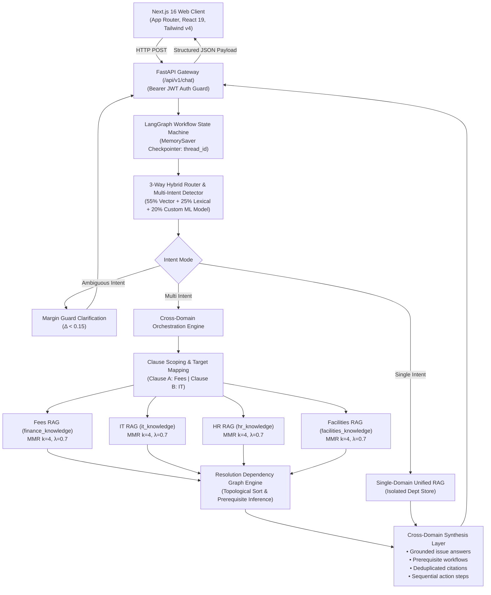

# CampusOne — System Architecture

**CampusOne** is an adaptive campus orchestration engine that provides one unified front door for university interactions. Rather than forcing student or faculty issues into a single department silo, CampusOne detects compound problems spanning multiple campus systems, orchestrates parallel grounded retrievals across isolated department knowledge bases, resolves prerequisite dependencies between institutional workflows, and synthesizes unified resolutions with source attribution.

---

## 1. End-to-End Orchestration Topology

---

## 2. Core Architectural Subsystems

### 2.1 3-Way Hybrid Router (`backend/routing/`)
Routing accuracy is achieved without relying on slow or non-deterministic large generative LLMs. Queries are classified on CPU in under 10ms via an ensemble of three complementary scorers:

1. **Semantic Vector Scorer (55% weight)**: Computes cosine similarity between sentence-transformer query embeddings (`all-MiniLM-L6-v2`) and precomputed domain centroid embeddings across `it`, `hr`, `fees`, and `facilities`.
2. **Lexical Scorer (25% weight)**: Keyword matching with token normalization, n-gram extraction, and negative anchors preventing misclassification on overlapping terms (e.g. "fee" vs "wi-fi").
3. **Calibrated ML Classifier (20% weight)**: A lightweight TF-IDF and logistic regression / calibrated classifier trained on verified campus queries.

#### Margin Guard Policy
$$\Delta = \text{Score}_{\text{top1}} - \text{Score}_{\text{top2}}$$
- When $\Delta \ge 0.15$ and Top-1 $\ge 0.75$, query automatically routes to the winning domain.
- When $\Delta < 0.15$, the turn enters `clarify` mode to safely solicit user disambiguation instead of guessing.

### 2.2 Multi-Intent Semantic Detection (`backend/routing/multi_intent.py`)
Rather than splitting queries by arbitrary sentence breaks, the multi-intent detector:
- Decomposes input using conjunction boundaries (`and also`, `as well as`, `in addition to`, `so now`), causal connectors (`therefore`, `so`), punctuation, and subordinate clauses.
- Runs independent 55/25/20 ensemble classification on each actionable clause ($\ge 3$ words).
- Enters `route_mode="multi"` only when two or more distinct departments have independent actionable clauses with confidence $\ge 0.35$ and margin $\ge 0.05$.

### 2.3 Strict Department Knowledge Base Isolation (`backend/rag/`)
Department knowledge stores are partitioned into isolated PostgreSQL PGVector collections:
- `finance_knowledge` (Tuition, scholarships, payment plans, refunds)
- `it_knowledge` (Credentials, Eduroam Wi-Fi, portal access, MFA, software)
- `hr_knowledge` (Payroll, student employment, benefits, leave policies)
- `facilities_knowledge` (Dormitories, maintenance requests, access keys, campus transit)

**Security Guarantee:** Cross-collection retrieval is physically prohibited at the query level. Sub-queries only search their mapped department collection via Maximal Marginal Relevance (`k=4`, $\lambda=0.7$).

### 2.4 Resolution Dependency Graph Engine (`backend/orchestration/dependency_graph.py`)
When a student's problem spans multiple systems, real-world institutional dependencies dictate the order of resolution. The engine incorporates verified university system workflows:
- `fees ➔ it`: Financial hold clearance on student accounts must precede course/exam registration portal access.
- `fees ➔ facilities`: Hostel fee payment confirmation is a prerequisite for room key issuance by the warden.
- `hr ➔ fees`: Graduate TA / scholarship fee concession approval must precede fee balance adjustments.
- `it ➔ facilities`: Active campus digital identity and RFID issuance precede electronic facility access.
- `hr ➔ it`: Official HR appointment must be processed before institutional IT directory accounts are created.
- `facilities ➔ fees`: Room vacation and clearance certificate are required before finance releases deposit refunds.

The engine validates relationships against retrieved document passages (scanning for prerequisite indicators such as *"required before"*, *"hold"*, *"clearance"*) and applies topological sorting so advice is presented in correct chronological order.

### 2.5 Cross-Domain Synthesis Layer (`backend/orchestration/engine.py`)
The synthesis layer constructs a structured, grounded response:
1. **Issue-by-Issue Fact Grounding**: Each sub-issue is explained with verbatim citations and confidence scores.
2. **System Dependencies**: Explicitly states how resolving one issue unlocks downstream systems.
3. **Concrete Action Plan**: Provides ordered next steps so the user knows exactly what to do first.
4. **Partial Failure Resilience**: If one department succeeds while another lacks grounded documentation, the system returns the grounded domain answer and escalates only the failing domain to human support.

### 2.6 LangGraph Conversational Workflow (`backend/graph.py`, `backend/graph_nodes.py`)
- **State Checkpointing**: Leverages LangGraph's `MemorySaver` checkpointer keyed by `thread_id=conversation_id` for multi-turn state continuity.
- **Contextual Follow-up Routing**: Detects conversational follow-ups (e.g. *"What should I fix first?"*) and inherits active domains and resolved dependencies from conversation state, eliminating anaphoric misrouting.
- **Human Escalation**: Transitions to human specialist queue when confidence remains $< 0.40$ or policy requires specialist intervention.
